# 四组项目情况展示

注：1. 请结合目录或大纲查看本文档。

2. 只列出发生变动的内容和新增的内容。

[TOC]


## 项目内容补充说明

### 数据流图

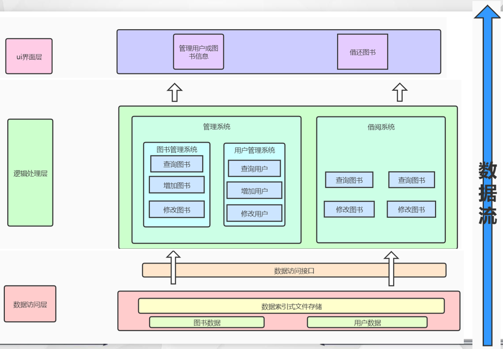

我们的底层结构完全独立，只需要编写对接代码，就可以用于其他项目，例如汽车租赁系统等等。

数据由文件中的二进制形式由对接代码转换成字符串形式供逻辑层使用，最后在ui层展示。

### 甘特图更新


### 文件结构

文件结构为老师在指导报告时最为重视的部分，在此作为重点补充。

#### 文件展示

我们的数据文件一共有9个，分别是：

**详细介绍请看文件结构说明**

```c++
book{

data.dat //数据文件

index.dat//索引文件

log.dat//日志文件

}
```

```c++
user{

data.dat//数据文件

index.dat//索引文件

log.dat//日志文件

}
```

```c++
userstates{ //该类型数据存放用户在借书籍清单

data.dat//数据文件

index.dat//索引文件

log.dat//日志文件

}
```

#### 数据分段

数据保存为键值对

##### book

```c++
(int id, string value)
//value字符串的长度固定为80，包含：ISBN, name, author, type,  borrowtime, returntime, history, onshelf, isovertime。
//onshelf, isovertime两个变量的取值为0或1，对应类中bool值，使用时转换类型即可。
``
```

##### user

```C++
(int id, string value)
//value字符串的长度固定为56，包含：name,college,major,password,email.
```

##### userstates

```c++
(int id, string bookid)
//id和user类的id是同一个id，bookid长度120，是一个20*6的顺序表，可以同时容纳最多20个借阅信息（限制用户借阅数量最大值为20）。
```

#### 文件结构说明

数据信息可由索引文件树形遍历

##### 1.索引文件：index.dat

索引文件前4个字节为根节点所在地址，若为0则树为空，初始时。接着8个字节为第一个空白位置，初始时为8，即文件尾。然后依次是每个节点。每个节点分为三个部分，第一部分为12个字节，四个整数，分别是**父节点地址、父节点在节点中的位置（从1开始）和当前节点关键码的个数**，根节点父节点地址为0。第二部分为**当前节点的关键码和其孩子的地址**，若节点为叶节点，则为当前节点的关键码和关键码对应的值在数据文件中的地址的负数（因此可以根据孩子地址的正负来直接区别内部节点和叶子结点）。第三部分为**下一个叶子节点的地址**，若节点为内部节点，则该部分无意义。空白位置组成单项链表，最后一项始终为文件末尾。删除节点后将地址链接到链表头部。

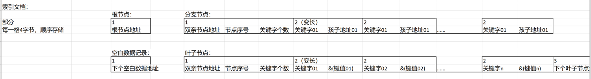

##### 2.数据文件：data.dat

数据文件前四个字节为第一个空白位置，初始时为4。之后为数据，每条数据占用(book数据一条占用80字节，user数据一条占用56，userstates数据占用120字节)。空白位置组成单项链表，最后一项始终为文件末尾。删除节点后将地址链接到链表头部。

#### 类的简要分类

1. class book
2. class user
3. class userstates 
4. class administor
5. class supervisor
6. class returnbook
7. class borrow

#### 类的关键信息补充介绍

为了避免冗余只补充class book、class userstates中的关键信息

```c
calss book{
    ......
    ......
    ......
        
    string history //借阅历史        
}
```

- history作为单本书的借阅历史保存在单本书的数据信息中。
- history中的信息只在借书时修改。
- history中的保存的信息是用户id
- 每个用户id定长8位，history中最多能保存5个人的id，一共40字节。
- 在第6个人借书时，如果history存满了5个人的id，那么history将会清空，第六个人的id作为第一条信息存入history。
- history中的保存的id不可删除，不可修改，只能增加，查询。


```c
calss userstates{
    int userid;
    string booklist //用户的在借书籍清单        
}
```

- class userstates 信息的作用是记录：某个人的在借书籍清单。
- booklist中保存此人已经借阅，但尚未归还的书籍id
- 每本书籍id定长6位，booklist中最多能保存20本书的id，一共120字节，也就是说一个人最多可以同时借20本书。
- booklist 会在借书，还书，用户管理（管理员帮助还书）时修改。
- 在booklist中，如果删除中间的一条书籍id，空下的空间会由后续的字符串填补。
- booklist保存的信息可以删除、修改、增加、查询。
- 还书时，用户无需登录，系统可通过要还书籍的history中保存的最后一个用户id，找到此用户的在借书单，删除该书id。

### ui界面的技术掌握

#### 技术掌握

在qt界面我们主要用到这三种组件：

1. 按钮点击触发事件
2. 输入信息绑定到参数
3. 获取参数并显示到信息栏

我们已经对其使用方法掌握。

逻辑层也制定好了和ui层的对接文档，因此逻辑层工作可以和ui层工作齐头并进。等待完成时对接。

#### demo展示

##### 界面跳转及点击事件


##### 点击确定

##### 跳转

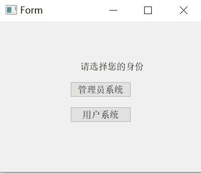

##### 点击事件代码

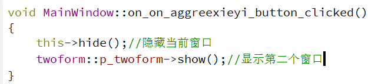


##### 输入信息回显

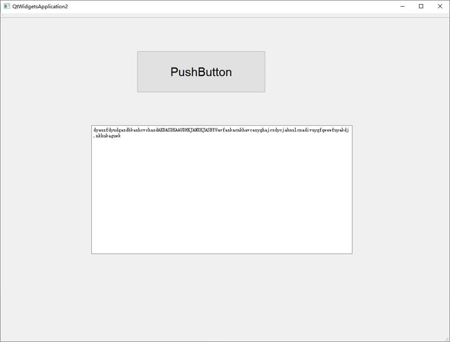

##### 代码

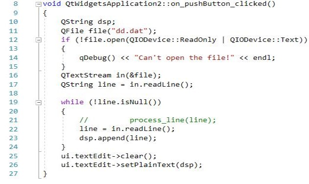


## 进度报告

### 底层进度

刘云卿、全子修

底层全部工作已经完成

包括书籍、用户、在借书单信息的文件保存增删查改

向逻辑层的对接的函数

代码：

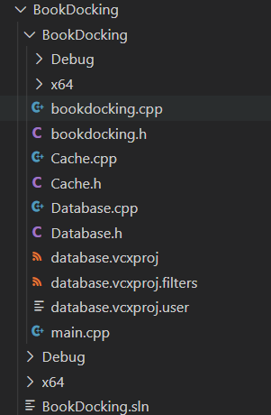

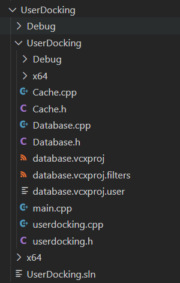

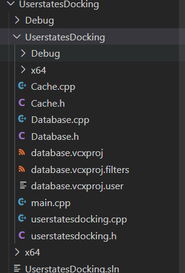

### 逻辑层进度

付可意、胡新月，孙久杰

管理员类里用户的增删改查函数以及管理用户函数基本完成，图书的增删改函数以及管理图书函数已经完成。还书函数基本完成，部分功能需要与借书函数对接。

已完成借阅系统用户登陆、注册界面，图书查找与借阅部分框架已完成，目前缺少按类、ISBN、书名查找的函数，用户信息与已借图书信息部分正在完善。

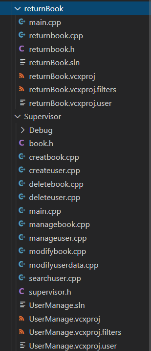

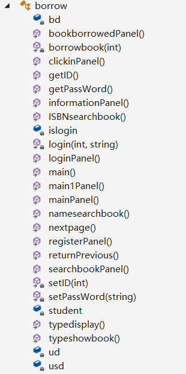

### ui层进度

寇金娣，毛鸿麟

界面层的进度:目前可以实现页面跳转和输入信息保存功能，已经做出来6个界面，根据接口文档来确定与逻辑层的接口。但界面的完整实现还需要整个项目的功能全部完成。

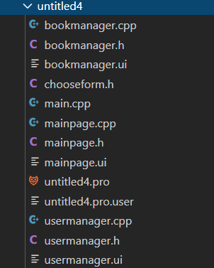

#### qt设计图

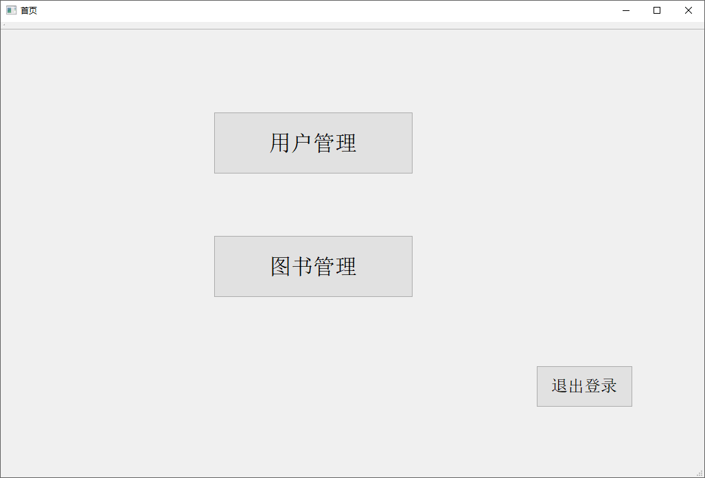

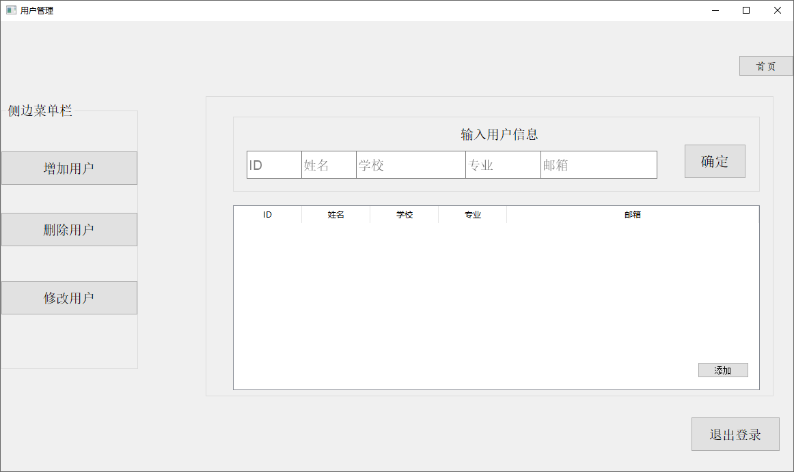

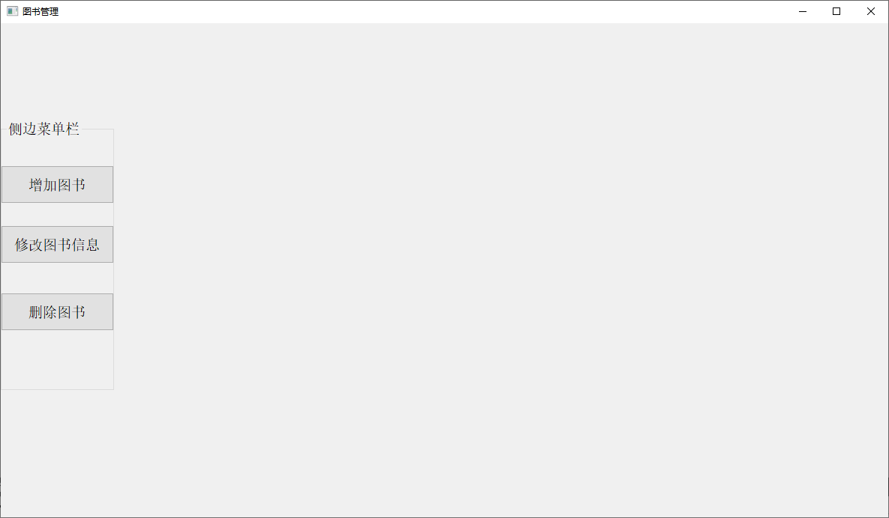

