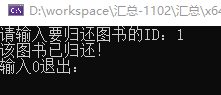
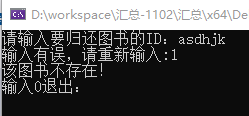
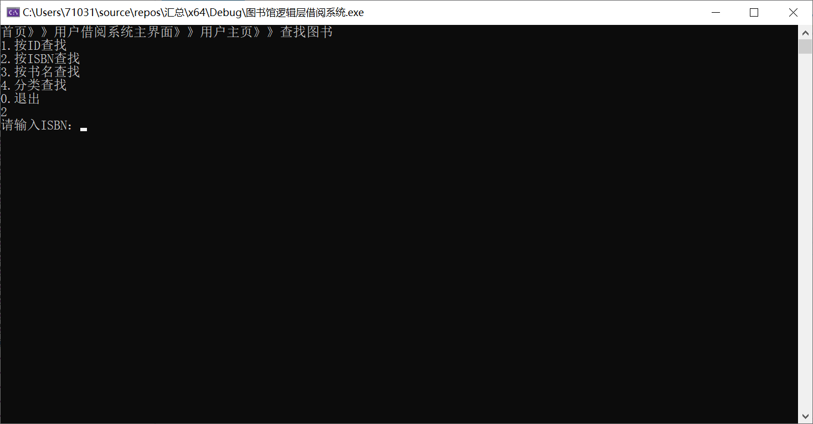
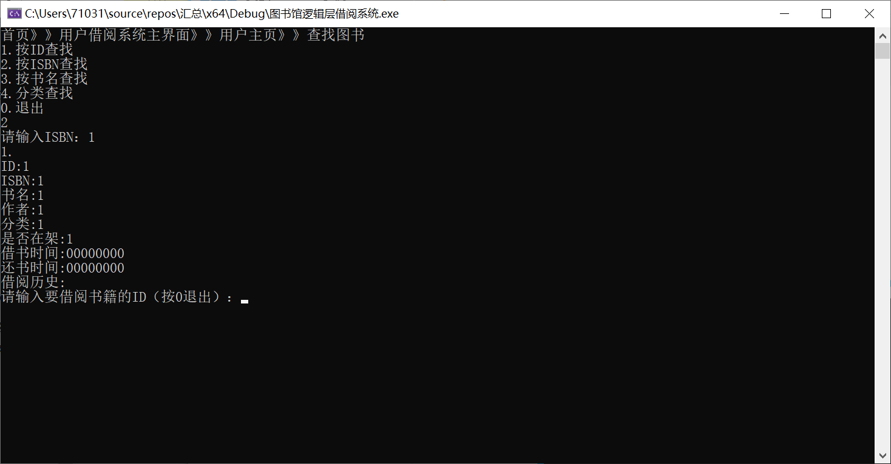
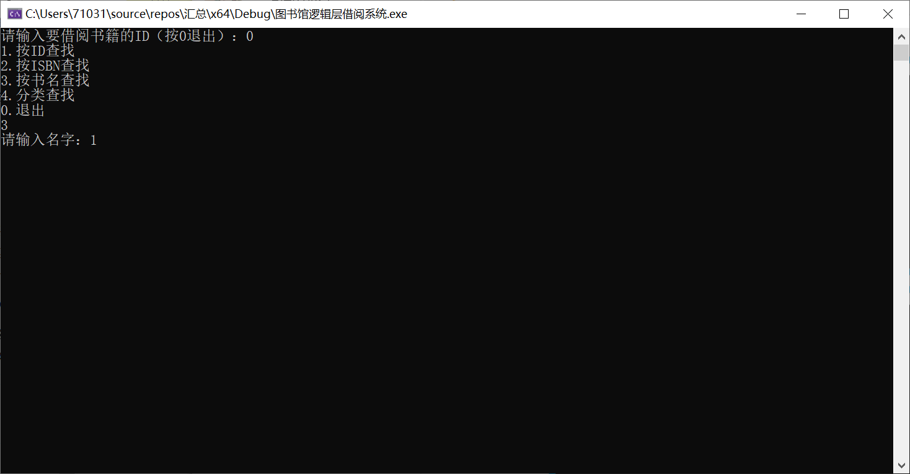
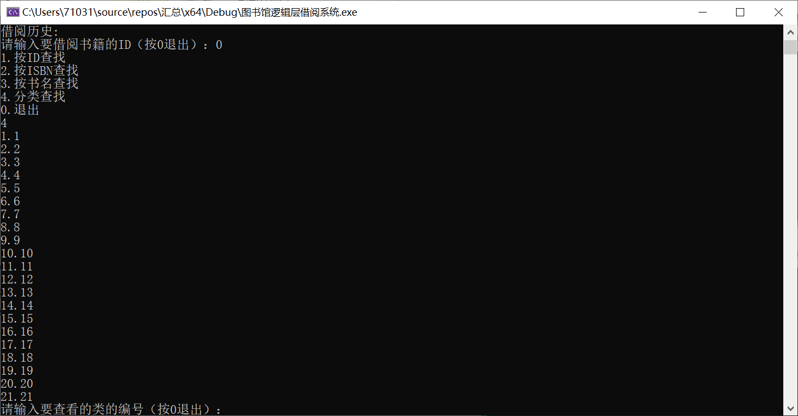
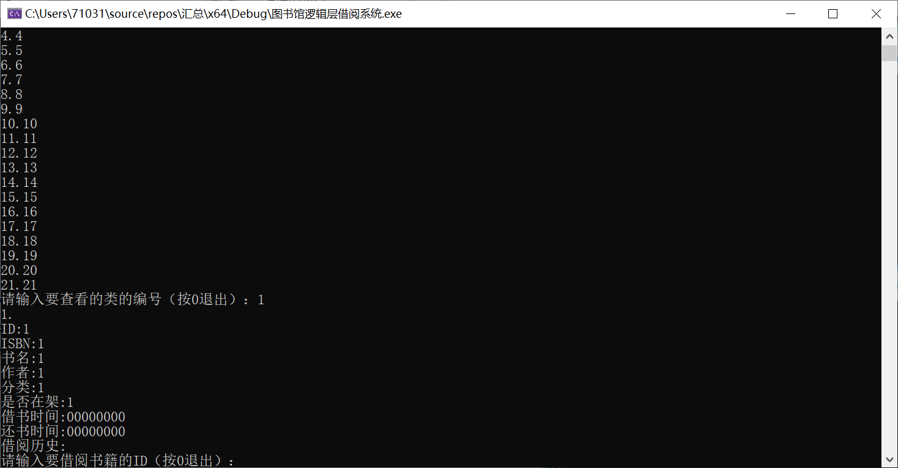
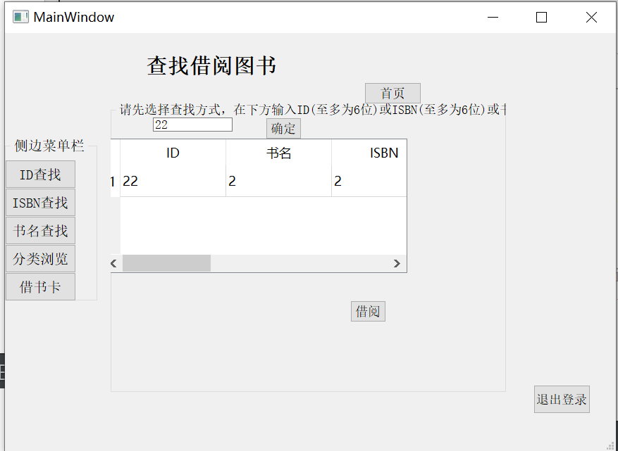
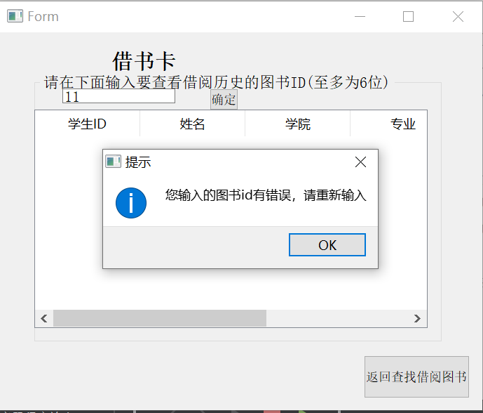
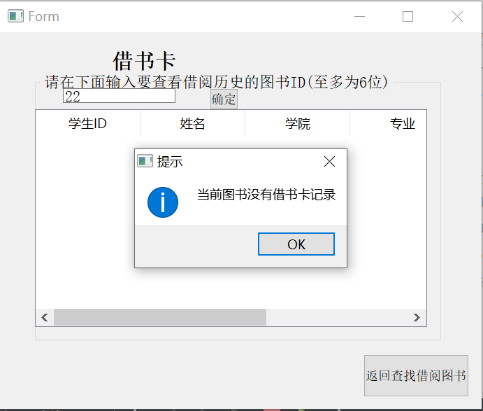

# 四组项目情况展示

注：

1. 请结合目录或大纲查看本文档。
2. 只列出发生变动的内容和新增的内容。

[TOC]


## 一、底层：补充——两级索引机制

​	本周内进行了一些增量开发，下面是相关说明

**注：基本功能已经实现，但是此部分正在与逻辑层对接，系统层级的按属性（书名、ISBN、作者）查找的功能还没有完成。**

### 	1. 设计原因

​		项目前中期，在底层开发的基于B+树的简易数据库系统在单个数据的查找上具有显著优势，当B+树为m叉、数据总量为N时，单次查找所需的时间复杂度仅为，相较于普通的顺序结构时间复杂度为N，极大的节省了查询开支，而且数据不必顺序存储，也不必有序，同时插入删除都极为方便。

​	但是，考虑到实际需求，用户需要按照书名、ISBN、作者等的方式进行查找，输入对应信息，应当得到信息相匹配的全部书籍信息，这样就需要对数据进行遍历。然而，由于B+树在逻辑上只能有一种关键字，不可能按照字符串构建B+树，因此按字符信息查找数据就首先要遍历id获取数据，时间复杂度为N^3. 这样就使用户的体验大打折扣。基于上述背景，底层刘云卿同学开发了第二级索引，它独立于先前的建议数据库的索引+数据之外，单独存储部分关键信息，轻量化，专用于按书名、ISBN、作者遍历。

### 	2. 定义

#### 		(1). 声明：

​		（**在先前的bookdocking.h基础上附加**）

```C++
#include <algorithm>
#define LENGTH_INDEXADDRESS 8

//public:
bool search_delete(int id);
bool file_update();
vector<string> search(string method, string value);

//private:
int firstEmpty;//指示添加空白地址位置的“数据指针”
int p_index;//存储数据的地址信息
int secEmpty;//指示删除空白地址位置的“数据指针”
int line_num;//行数，此变量已弃用
int cir_time; //运行次数，此变量已弃用


string v_index, zero_str, new_str, blank_str;//存储地址信息的字符串、零串（由数个"0"构成）、（已弃用字符串）、空白串（由数个" "构成）
string to_id, to_value,c_to_str;//存储id的字符串形式的临时变量、存储其他信息的字符串形式的临时变量、（已弃用字符串）
fstream secData, Empty;//两个新的文件指针

```

#### (2). 实现

以下为实现：

##### Ⅰ. 构造、析构函数的重新设计

```C++
bookdocking::bookdocking(){
	Empty.open("valEmpty.txt", ios::in | ios::out | ios::binary);
	secData.open("secIndex.txt", ios::in | ios::out | ios::binary);
	if (!secData) {
		Empty.close();
		secData.close();
		ofstream uEmpty("valEmpty.txt", ios::binary);
		ofstream pData("secIndex.txt", ios::binary);
		uEmpty.close();
		pData.close();
		Empty.open("valEmpty.txt", ios::in | ios::out | ios::binary);
		secData.open("secIndex.txt", ios::in | ios::out | ios::binary);
	}
	secData.write("\n", sizeof(char));
	blank_str = string(LENGTH_ID + LENGTH_VALUE, ' ');
	firstEmpty = 0;//置0
	secEmpty = 0;
	zero_str = "00000000";//零串初始化
}
```

```C++
bookdocking::~bookdocking() {
	Empty.close();
	secData.close();
}
```

##### Ⅱ. 类中函数的重新设计

###### 	①. bookadd函数

```C++
bool bookdocking::bookadd(int id,string ISBN, string name, string author, string type, string borrowtime, string returntime, string histroy, string onsheelf, string isovertime)
{	
	Empty.clear();
	secData.clear();
	to_id = to_string(id);
	value = ISBN + name + author + type + borrowtime + returntime + histroy + onsheelf + isovertime;
	to_value = value;
	if (database.insert(id, value)) {
		if (Empty.peek() != EOF) {//判断是否到达文件尾
			Empty.seekg(0, ios::beg);
			getline(Empty, v_index);//读一行数据，其为8字节的地址数据
			while (!atoi(v_index.c_str())) {//找到二级索引中第一个非00000000的行，读取其数据作为二级数据文件中待插入地址
				firstEmpty = Empty.tellg();//读取读指针位置
				if (Empty.peek() == EOF) goto SIG_3;//有条件跳转
				getline(Empty, v_index);//只要id是00000000，就继续读下一行
			}
			Empty.clear();
			secData.seekp(atoi(v_index.c_str()), ios::beg);//移动写指针到正确位置
			secData.write(to_id.c_str(), LENGTH_ID);//写id数据
			secData.write(to_value.c_str(), LENGTH_ISBN + LENGTH_NAME + LENGTH_AUTHOR);//写入关键数据
			secData.write("\n", sizeof(char));//换行
			secData.clear();
			Empty.seekp(firstEmpty, ios::beg);//写指针移至指示位置
			//将该处数据置为00000000，也就不再指示数据文件空白位置了
			Empty.write(zero_str.c_str(), LENGTH_INDEXADDRESS);
			firstEmpty = Empty.tellp();
			firstEmpty += 1;//跳一行
		}
	else {//当二级索引为空
		SIG_3:
		Empty.clear();
		secData.seekp(0, ios::end);//数据一定连续存储，所以在文件尾新增
		secData.write(to_id.c_str(), LENGTH_ID);//写数据
		secData.write(to_value.c_str(), LENGTH_ISBN + LENGTH_NAME + LENGTH_AUTHOR);//写数据
		secData.write("\n", sizeof(char));
	}
	return true;
	}
	else
		return false;
}
```

###### 	②. bookdelete函数

```C++
bool bookdocking::bookdelete(int id) {
	string temp;
	Empty.clear();
	secData.clear();
	if (database.remove(id)) {
		if (search_delete(id)) {//调用
			return true;
		}
		else return false;
	}
	else
		return false;
}
```

###### 	③. search_delete函数

```C++
bool bookdocking::search_delete(int id) {//查找二级数据文件中数据的地址，并删除之；同时在二级索引中为删除后留下的空白行标注其地址
	int red = 0, ret = 0;//red接收数据，ret已弃用
	string rec, recc;//rec接收数据，recc截取rec的一部分
	int tmpPr = 0;
	Empty.clear();
	secData.clear();
	if (secData.peek() == EOF)
		return false;
	secData.seekg(0, ios::beg);
	getline(secData, rec);//跳过文件首行空行
	p_index = secData.tellg();//移动读指针
	getline(secData, rec);//读一行并存储
	recc = rec.substr(0, LENGTH_ID);//截取
	red = atoi(recc.c_str());//转换为int
	while (red != id) {//如果与待查id不等，需要再搜索
		if (secData.eof()) {
			break;
		}
		p_index = secData.tellg();
		getline(secData, rec);
		recc = rec.substr(0, LENGTH_ID);
		red = atoi(recc.c_str());
	}
	if (red != id) {
		secData.clear();
		return false;
	}
	else {
		secData.clear();
		secData.seekp(p_index, ios::beg);
		secData.write(blank_str.c_str(), LENGTH_ID + LENGTH_ISBN + LENGTH_NAME + LENGTH_AUTHOR);//用空格符替换数据，该行成为空行
		secData.clear();
		Empty.clear();
		v_index = to_string(p_index);//转换为字符串
		if (Empty.peek() == EOF) {//空文件时
			Empty.clear();
			Empty.seekp(0, ios::beg);
			Empty.write(v_index.c_str(), LENGTH_INDEXADDRESS);//写入空行的地址信息
			Empty.clear();
		}
		else {//非空
			Empty.seekg(0, ios::end);
			secEmpty = Empty.tellg();
			cout << secEmpty;
			Empty.clear();
			Empty.seekp(secEmpty + 1, ios::beg); //移动写指针
			Empty.write("\n", sizeof(char));//必须先换行
			Empty.write(v_index.c_str(), LENGTH_INDEXADDRESS);//写入新增的空行所在位置的信息
			Empty.clear();
		}
		return true;
	}
}
```

###### 	④. search函数

本函数用于对二级数据进行遍历。适用于按ISBN、按书名、按作者名等查找。可被逻辑层直接调用。

```C++
vector<string> bookdocking::search(string mod, string value) {
	vector<string> datas;
	string temp;
	int par = 0;
	int len = 0;
	secData.clear();
	getline(secData, temp);
	if (mod == "ISBN") {
		par = LENGTH_ID + START_ISBN;
		len = LENGTH_ISBN;
	}
	else if (mod == "name") {
		par = LENGTH_ID + START_NAME;
		len = LENGTH_NAME;
	}
	else if (mod == "author") {
		par = LENGTH_ID + START_AUTHOR;
		len = LENGTH_AUTHOR;
	}
	else {
		cout << "Invalid searching mod detected." << endl;
		goto SIG_4;
	}
	while (secData.peek() != EOF) {
		getline(secData, temp);
		temp = temp.substr(par, len);
		datas.push_back(temp);
	}
	reverse(datas.begin(), datas.end());
	return datas;
SIG_4:
	datas.clear();
	return datas;
}
```

###### 	⑤. file_update函数

​	本函数用于在累计进行插入、删除操作足够多时，清除二级索引中冗余的"00000000"行。

```C++
bool bookdocking::file_update() {
	vector<string>cache;
	string temp = "";
	Empty.clear();
	while (Empty.peek() != EOF) {
		getline(Empty, temp);
		temp = temp.substr(0, LENGTH_INDEXADDRESS);
		if (temp == "        ") continue;
		if(atoi(temp.c_str()))cache.push_back(temp);
	}
	fstream f("valEmpty.txt", fstream::out | ios_base::trunc);
	reverse(cache.begin(), cache.end());
	while (!cache.empty()) {
		temp = cache.back();
		cache.pop_back();
		f.write(temp.c_str(), LENGTH_INDEXADDRESS);
		f.write("\n", sizeof(char));
	}
	return true;
}
```

### 3. 调试

​	在命令行版本的图书管理系统中，使用如下测试样例：

```txt
2 11111111 2 2 2 2
2 22222222 2 2 2 2
2 33333333 2 2 2 2
2 44444444 2 2 2 2
2 55555555 2 2 2 2
2 66666666 2 2 2 2 
3 22222222
3 44444444
0
```

​	所得文件数据如下：**（注：均为二进制格式文件）**

##### 		Ⅰ. 二级索引

![notepad_[75] 2020-11-04 17_00_18](C:/Users/Skywo/Documents/GitHub/Library-Management-System/底层/SecondaryIndex/Img/notepad_[75] 2020-11-04 17_00_18.png)

​			注：由于是二进制文件，所以有乱码。两个地址的值分别是28，和82。

##### 		Ⅱ. 二级数据文件

![notepad_[76] 2020-11-04 17_00_31](C:/Users/Skywo/Documents/GitHub/Library-Management-System/底层/SecondaryIndex/Img/notepad_[76] 2020-11-04 17_00_31.png)

### 4. 开发说明

​	只需要调用file_update函数以清理冗余数据，其他函数不需要调用，一、二级数据、索引文件构成的简易数据库对增删改查操作是同步的，逻辑严密，用户只需要聚焦于他们的需求操作。

​	二级数据、索引文件在程序运行时与一级数据、索引文件同步读写，只保存最关键的部分内容。二级文件的存取逻辑是，新增书籍信息时，先检查二级索引的数据，确认在二级数据文件中是否有空白行，若有，则在空白行处插入，否则在文件末插入。删除书籍信息时，将二级数据文件中对应的一行置为空白行，然后在二级索引中记录该行的地址，作为可用地址备用；查找时，略过现有的空白行；当增删次数累积足够多时，只需要调用file_update函数以删除二级索引中积累的冗余数据，实现了空间的复用。在实现遍历时，速度大幅提高。

## 二、底层：简易数据库的实现

### 1. 数据结构的实现原理

***\*B+-tree\****：应文件系统所需而产生的一种B-tree的变形树，其性质如下：

一棵m阶的B+树，

1. 有n棵子树的结点中含有n个关键字；
2. **.所有的叶子结点中包含了全部关键字的信息**，及指向含有这些关键字记录的指针，且叶子结点本身依关键字的大小**自小而大的顺序**链接。
3. **所有的非终端结点可以看成是索引部分**，结点中仅含有其子树根结点中最大（或最小）关键字。
4. 树中每个结点最多含有m个孩子（m>=2）
5. 除根结点和叶子结点外，其它每个结点至少有[(m / 2)]个孩子；
6. 若根结点不是叶子结点，则至少有2个孩子（特殊情况：没有孩子的根结点，即根结点为叶子结点，整棵树只有一个根节点）
7. 所有叶子结点都出现在同一层，叶子结点不包含任何关键字信息(可以看做是外部接点或查询失败的接点，实际上这些结点不存在，指向这些结点的指针都为null)；
8. 每个非终端结点中包含有n个关键字信息： (n，P0，K1，P1，K2，P2，......，Kn，Pn)。其中：
       a)  Ki (i=1...n)为关键字，且关键字按顺序升序排序K(i-1)< Ki。 
       b)  Pi为指向子树根的接点，且指针P(i-1)指向子树种所有结点的关键字均小于Ki，但都大于K(i-1)。 
       c)  关键字的个数n必须满足： [ceil(m / 2)-1]<= n <= m-1。

### 2. 实现情况

在命令行版本的图书管理系统中，使用如下测试样例：

```txt
2 11111111 2 2 2 2
2 22222222 2 2 2 2
2 33333333 2 2 2 2
2 44444444 2 2 2 2
2 55555555 2 2 2 2
2 66666666 2 2 2 2 
3 22222222
3 44444444
2 11451419 19 810 364 893
2 19198101 14 514 889 464
2 10101010 1010 1010 1010 1010
3 33333333
3 55555555
2 36436411 4514 1919 810 889
2 36436436 4 364 364 364
3 66666666
2 43964396 4396 4396 4396 4396
2 19260817 -1 -1 -1 -1
3 10101010
2 17471747 893 810 0721 2333
0
```

**所得一级数据文件（二进制存储）：**

```
?  2     2       2   2   00-00-0000-00-00aaaaaaaaaaaaaa                          1114    514     889 464 00-00-0000-00-00aaaaaaaaaaaaaa                          114     364     364 364 00-00-0000-00-00aaaaaaaaaaaaaa                          11 9    810     364 893 00-00-0000-00-00aaaaaaaaaaaaaa                          114514  1919    810 889 00-00-0000-00-00aaaaaaaaaaaaaa                          114396  4396    4396439600-00-0000-00-00aaaaaaaaaaaaaa                          11893   810     0721233300-00-0000-00-00aaaaaaaaaaaaaa                          11 1    -1      -1  -1  00-00-0000-00-00aaaaaaaaaaaaaa                          11 
```

**所得一级索引文件：**

```
x   ?   x         菉? ?籍 ??曫$?狜?l?@   x         戝%听基+件赠+\熳?l?熳?l?x              菉?    戝%@   狜?l?        @   
```

使用Hexdump查看二进制数据：

![index.txt.hexdump_-_Visual_Studio_Code [70] 20-11-04 22_58_38](.\Img\index.txt.hexdump_-_Visual_Studio_Code [70] 20-11-04 22_58_38.png)

可见，数据能够按预期定义存储。运行截图如下：


**注：只包含底层内容（数据处理），实际的图书系统界面及功能更为全面**


![[71] 20-11-04 23_02_22](.\Img\[71] 20-11-04 23_02_22.png)


![[73] 20-11-04 23_02_34](.\Img\[73] 20-11-04 23_02_34.png)


可见系统运行符合逻辑，数据处理完善。至此，底层开发的简易文件系统已经开发完毕。

## 三、逻辑层：

​	逻辑层付可意和胡新月同学完善了还书功能的实现，完成了管理员系统的部分bug调试工作，给每一次输入增设了输入检查；完成了与UI层对接的代码版本更新，修改了已知bug。

​	逻辑层孙久杰同学完善了多种方式借书功能的实现，为数据输入增设了输入检查；目前正要与UI层修改bug，以及添加续借等附加功能。




















## 四、UI层

​	整个界面已经整合完毕，管理员系统可以正常使用，借阅系统运行时出现错误，还在寻找解决方案。附加功能根据逻辑层完成时间再决定是否对界面实现此功能。界面美化待定时间。










## 五、规划

​	计划在本周完成的任务：整合、UI调试、续借及借阅记录机制的优化、借书卡功能的优化、推荐机制、批量导入书籍信息等