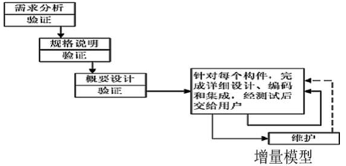

# 工程概述

## 增量模型

使用增量模型时，第一个增量构件往往实现软件的基本需求，提供最核心的功能

当把新构件集成到现有构件中时，所形成的产品必须是可测试的

增量模型把整个软件产品分解成许多个增量构件，分批地逐步向用户提交产品

瀑布模型或快速原型模型目标是一次就把一个满足所有需求的产品提交给用户

# 可行性研究

## 层次方框图

## 系统流程图

### 模块图

### 流程图

#### 环形复杂度

## 数据流图

## 数据字典

# 需求分析

## IPO图

# 工作量估算

## 估算开发时间

## 甘特图

## 估算工程进度