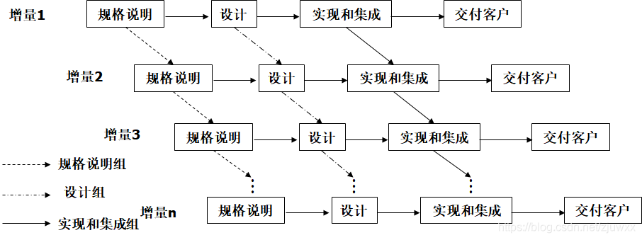

# 设计分析

## 需求分析

增量模型

### 增量模型

使用增量模型时，第一个增量构件往往实现软件的基本需求，提供最核心的功能

当把新构件集成到现有构件中时，所形成的产品必须是可测试的

增量模型把整个软件产品分解成许多个增量构件，分批地逐步向用户提交产品

瀑布模型或快速原型模型目标是一次就把一个满足所有需求的产品提交给用户

### 核心需求

### 增量需求

## 可行性分析

#### 

# 概念结构设计

### 层次分工图

### 系统流程图

### 简化模块图

#### 详细流程图

##### 环行复杂度

#### 数据流图

#### IPO图

# 逻辑结构设计

# 物理结构设计

# 详细分工

# 工程进度控制

## 开发时间

### 甘特图

## 开发进度安排

## 当前进度

## 