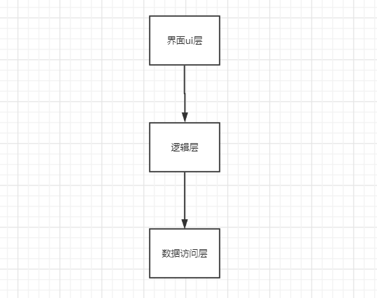
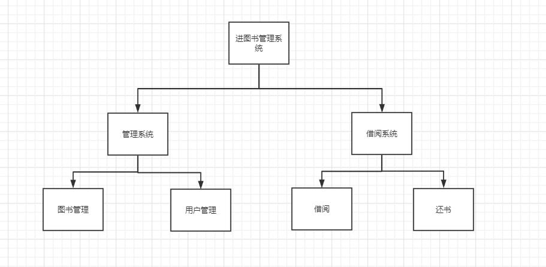
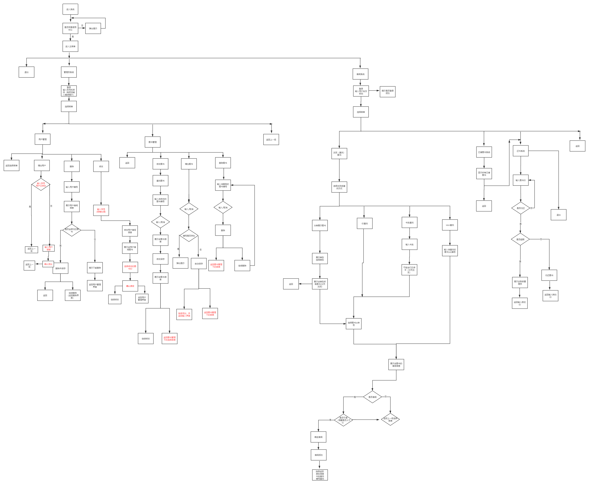

# 设计分析

## 需求分析

### 增量模型

我们的程序决定采用增量模型的结构，把整个程序分解成许多个增量构件，第一个增量构件往往实现软件的基本需求，提供最核心的功能，然后再分批地实现后续功能逐步提交产品。

### 核心需求

对图书的增删查改

对用户的增删查改

借书还书

### 增量需求

多线程拆分关键字搜索

模拟借书卡

图书排行榜推荐

续借图书

数据安全性研究

## 可行性分析

在程序与数据交互访问层面我们讨论了各种解决方案

#### 风险分析

对一些附加功能的风险进行了分析，设计了优先级

# 概念结构设计

指导思想：低耦合高内聚

### 层次分工图

### 简单模块图

### 系统流程图

#### 详细流程图

##### 环行复杂度

我们没有直接计算出环行复杂度，而是根据减小环形复杂度的办法：减小边，增多节点数，减少判断节点。多次优化了流程图。

#### 数据流图

#### IPO图

# 物理结构设计

# 逻辑结构设计

# 界面结构设计

# 详细分工

# 工程进度控制

## 开发时间

### 甘特图

## 开发进度安排

## 当前进度

## 