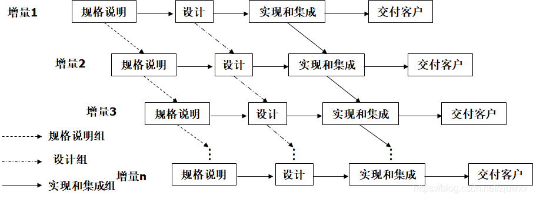

# 四组结课展示

## 一、项目规划与分析

## 1. 需求分析

### (1). 增量模型

我们的程序采取增量模型的开发方式，首先在第一个构件完成核心功能，然后在后续构件完成其他功能。

#### 核心功能：

图书增删改查

用户增删改查

借还书

#### 增量：

按不同方式检索书籍

续借功能

用户信息、书籍信息的合法性判断

模拟借书卡

关键字搜索

批量导入书籍

图形界面

### (2). 用户需求分析

用户的需求首先是信息的安全性，需要我们保证存取数据不会发生错误；

其次，用户需要简易友好的操作逻辑，降低学习与使用成本。

因此，我们做出如下规定：

1. **输入的信息必须合法**，不能出现任何乱码、错误、读取不到甚至是系统崩溃等情况，对用户的输入进行严格限制，禁止一切不规范的字符输入
2. 

## 二、项目技术

## 三、项目管理

## 四、项目分工

## 五、项目总结