# 1.说明：不需要与逻辑层的交接

同意使用协议按钮：in_checkbox

进入按钮：in_button

该界面头文件：onewelcome.h，类名称：OneWelcomeW

该界面关联的实体类头文件：objone.h  类名称：Objone

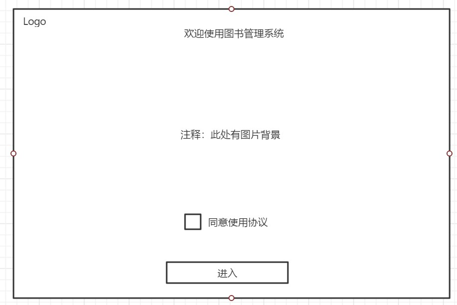

# 2. 逻辑层:以ID，密码为参数的“验证密码”是否正确函数，包括管理员和用户的,返回bool值

管理员登录：bool supervisor::login(int id, string password)

用户登录：bool borrow::qtlogin(int id,string password)；

Ui层：账号输入框：id_linedit

密码输入框：password_linedit

管理员身份按钮：checkBox

确定按钮：login_button

退出按钮：return_button,返回到上一界面

该界面头文件：twologind.h 类名称：TwoLoginD

该界面关联的实体类头文件：objtwologin.h 类名称：Objtwologin

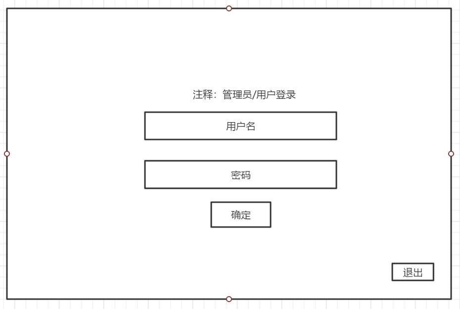

# 3.    不需要逻辑层接口

ObjectName：

首页：MainPage

用户管理：usermanagement

图书管理：bookmanagement

退出登录：exitlogin

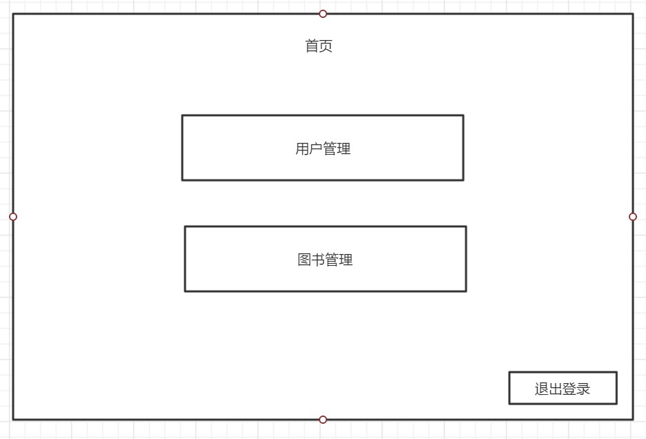

# 4.   用户管理界面默认显示增加用户groupbox

逻辑层：“增加用户”需判别用户是否重复，提供以ID为参数的“判别用户重复（存在）”函数。

逻辑层函数：	（删除添加按钮）

bool createuser(int id, string name, string password, string college, string major, string email);

头文件：

\#include"userdocking.h"

\#include"supervisor.h"

Ui层将从文本框得到的信息分条保存，返回给逻辑层以各个信息（ID,姓名，学校，专业，邮箱）字符串为参数的“保存函数”，还需提供各个信息的get函数

Ui层：首页按钮是返回“管理员首页（图片3）”；显示信息ui层来显示，将从文本框得到的信息显示；确定按钮，需要弹出提示框显示用户是否重复，槽函数为判定是否存在函数；显示信息考虑用label；添加按钮则关联槽函数保存函数；退出登录按钮是跳转到管理员登录界面

ObjectName：用户管理：UserManager

首页（按钮）：gotomainpage

侧边菜单栏：sidemenu

退出登录：exitlogin1

增加用户：addusers

修改用户信息：updateusers

删除用户：deleteusers

确定：confirmsure

添加：addsure

ID：le_id

姓名：le_name

学校：le_school

专业：le_major

邮箱：le_email

表格：infotable

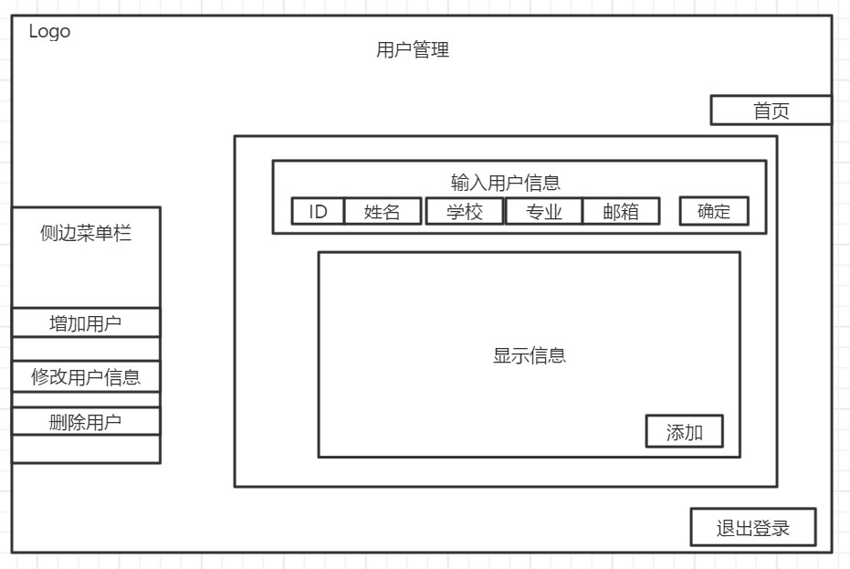

# 5.    修改用户信息界面：

逻辑层：提供以用户ID为参数的“验证用户是否存在”的函数；提供ID的get函数；提供修改用户信息的以对应信息为参数的修改函数，确认修改按钮需提供以ID和信息字符串为参数的函数

逻辑层函数：(删除修改id的选项)

string DisplayUser(int id)

(先exist 不存在则返回value=“不存在该用户”，存在得到用户信息value)

**截取部分：**

**name = value.substr(0, 8);**

**college = value.substr(8, 4);**

**major = value.substr(12, 4);**

**password = value.substr(16, 16);**

**email = value.substr(32, 24);**

bool modifyuserName(int id,string name);

bool modifyuserCollege(int id,string college);

bool modifyuserMajor(int id,string major);

bool modifyuserEmail(int id,string email);

头文件：

\#include"userdocking.h"

\#include"supervisor.h"

UI层：首页按钮是返回“管理员首页（图片4）”；输入后面的确定按钮是要检查用户是否存在，弹出信息框；确认修改按钮弹出信息框修改成功；侧边菜单栏一直显示，右边的groupbox根据菜单栏所选按钮进行改变，菜单栏各个按钮需关联槽函数groupbox的显示与隐藏函数，ui层提供被修改的信息字符串

objectname：修改用户信息：UserUpdate

首页：gotomainpage

修改ID：updateid

修改姓名：updatename

修改学校：updateschool

修改专业：updatemajor

修改邮箱：updateemail

显示信息：infotable

返回用户管理：returnusermanager

确定（上）：confirm1

确定（下）：confirm2

输入ID：inputid

输入要修改的信息：inputinf

确认修改：updatesure

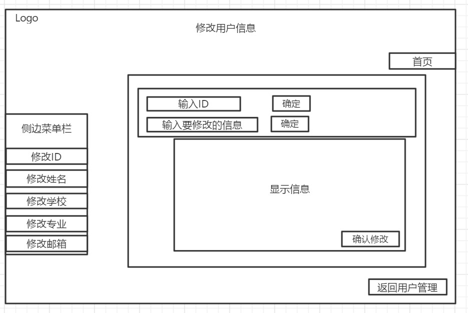

# 6.    删除用户界面

逻辑层：提供以ID为参数的验证学生ID是否存在的函数；提供以ID为参数的显示借阅信息的函数；提供以ID为参数的删除用户的函数

逻辑层函数：

string DisplayUserBookid(int id)

bool deleteuser(int id);

UI层：确定按钮弹出提示是否有该用户；删除按钮槽函数；首页，退出登录如上

ObjectName：用户管理：UserDelete

首页（按钮）：gotomainpage

侧边菜单栏：sidemenu

退出登录：exitlogin

增加用户：addusers

修改用户信息：updateusers

删除用户：deleteusers

输入学生ID：le_id

确定：confirmsure

删除：deletesure

显示借阅信息：borrowinfotable

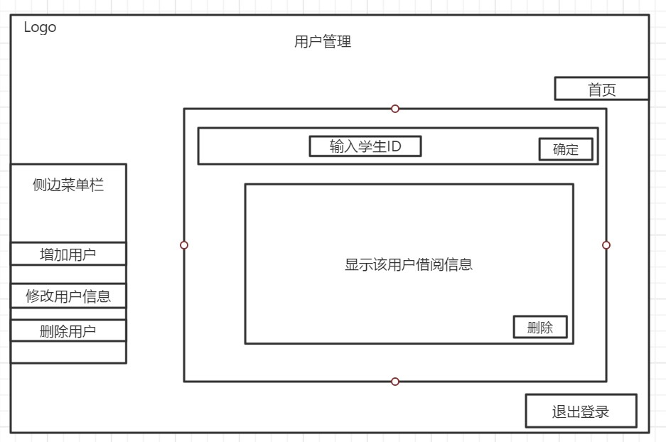

#  7.    图书管理界面默认显示增加图书groupbox；首页是回到管理员首页（图4）；退出登录回到管理员界面；

逻辑层：增加图书：提供以图书ID为参数判别书是否存在的函数；提供以各个信息为参数的增加图书函数；

逻辑层函数：

\#include "bookdocking.h"

\#include "supervisor.h"

bool createbook(int id,string ISBN,string author,string name,string type) 

UI层：确定弹出提示框该书是否存在；添加按钮关联槽函数；对应菜单栏的每个按钮槽函数；返回图书管理函数；首页函数；删除添加按钮

objectname：图书管理：BookManager

增加图书：addbooks

修改图书信息：updatebooks

删除图书：deletebooks

首页：gotomainpage

退出登录：exitlogin

确定：confirmsure

添加：addsure

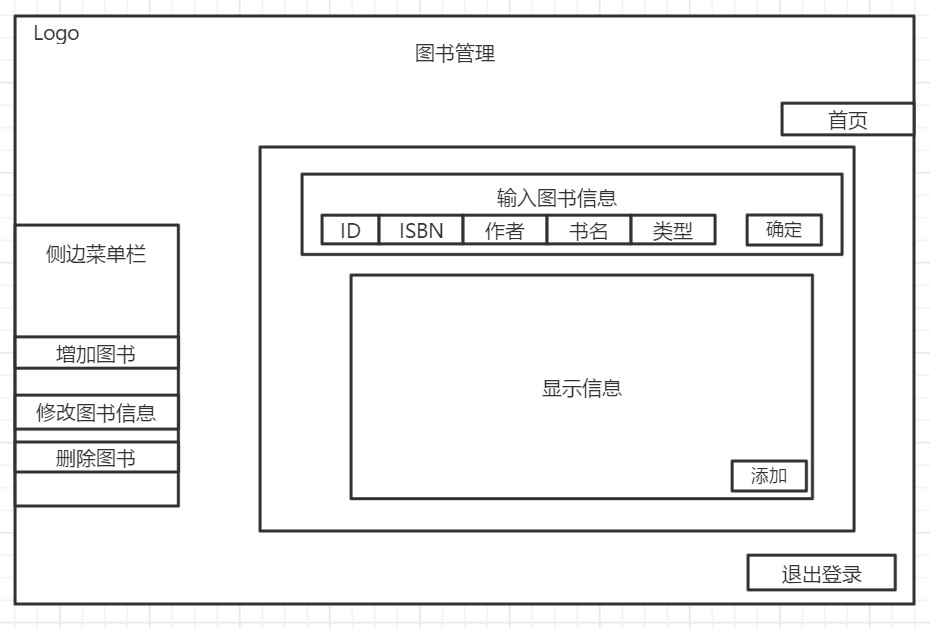

# 8.    图书管理修改图书信息界面

逻辑层：以图书ID为参数的验证图书是否存在的函数；以图书ID和要修改的信息为参数的图书保存函数，共修改7个状态，需要7个函数；

逻辑层函数：

\#include "bookdocking.h"

\#include "supervisor.h"

string DisplayUser(int id)

(先exist 不存在则返回value=“不存在该用户”，存在得到用户信息value)

bool modifybookISBN(int id,string ISBN)

bool modifybookName(int id,string name)

bool modifybookAuthor(int id,string author)

bool modifybookType(int id,string type)

bool modifybookOnsheelf(int id,string onsheelf)

bool modifybookIsovertime(int id,string isovertime)

截取方式：

//展示图书信息

value = docking.booksearch(id);

//把得到的包含所有信息的字符串分发给各个字段

ISBN = value.substr(0, 6);

name = value.substr(6, 8);

author = value.substr(14, 4);

type = value.substr(18, 4);

borrowtime = value.substr(22, 8);

returntime = value.substr(30, 8);

history = value.substr(38, 20);

onsheelf = value.substr(58, 1);

isovertime = value.substr(59, 1);

UI层：ID确定按钮弹出提示书籍是否存在；确认修改按钮槽函数；

修改图书信息：BookUpdate

修改ID：updateid

修改ISBN：updateisbn

修改书名：updatebookname

修改作者：updatewriter

修改类型：updatebooktype

修改在架信息：updateshelf

修改借阅状态：updatestatus

确定（上）：confirm1

确定（下）：confirm2

确认修改：updatesure

输入ID：inputid

输入要修改的信息：inputinf

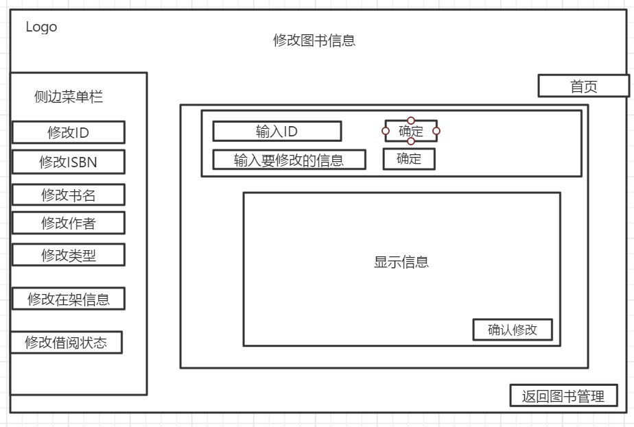

#  9.    图书管理删除图书界面

逻辑层：该书的所有信息的get函数；以ID为参数的该书是否在架（是否可以删除）bool函数；以ID为参数的删除图书函数；

逻辑层函数：

\#include "bookdocking.h"

\#include "supervisor.h"

string DisplayBook(int id)

(先exist 不存在则返回value=“不存在该用户”，存在得到用户信息value)

bool deletbook（int id）

UI层：确定按钮弹出信息框提示图书是否存在；删除按钮提示是否否删除成功，关联槽函数删除图书；

图书删除：BookDelete

增加图书：addbooks

修改图书信息：updatebooks

删除图书：deletebooks

首页：gotomainpage

退出登录：exitlogin

输入图书ID：le_id

确定：confirmsure

删除：deletesure

显示借阅信息：borrowinfotable

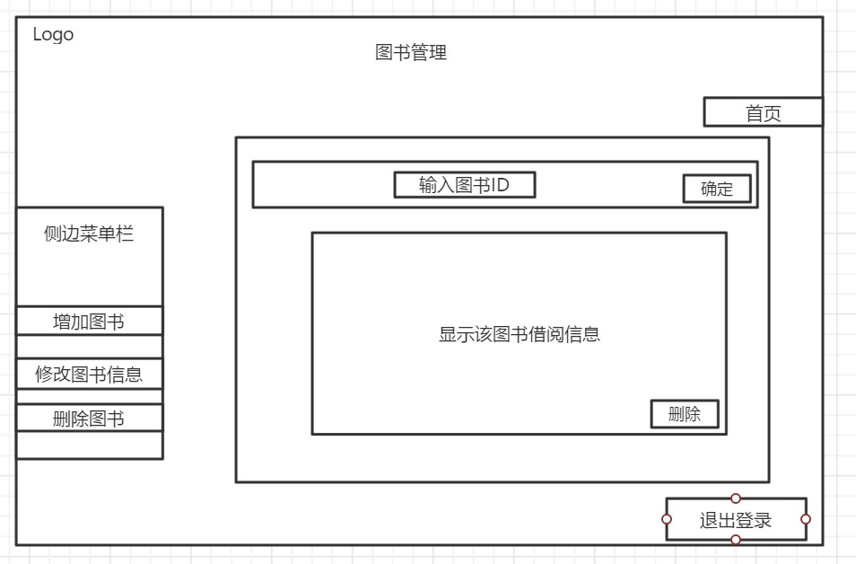

# 10.  用户首页

逻辑层：不需要

UI层：查找借阅图书按钮：seek_button  

对应界面头文件elevenuserwid.h 与其关联类的头文件o11userwid.h

​     已借图书按钮：borrowed_button

对应界面头文件userborrowedwid.h 与其关联类的头文件ouserborrowed.h

​       归还图书按钮：returnbook_button

对应界面头文件userreturnwid.h 与其关联类的头文件ouserreturn.h

​      退出登录按钮：relogin_button

该界面头文件：twologind.h 类名称：TwoLoginD

该界面关联的实体类头文件：objtwologin.h 类名称：Objtwologin

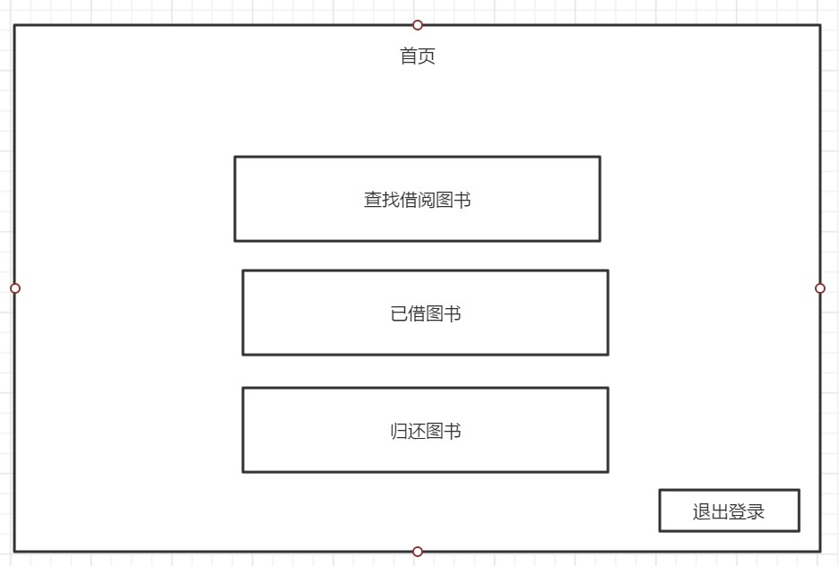

# 11.  查找借阅图书界面：

逻辑层：以ISBN字符串为参数的查找图书函数（待实现）；以书名字符串为参数的查找图书函数（待实现）；

以ID字符串为参数的查找图书函数bool borrow::qtbookexist(int id);

图书各条信息需单独返回字符串book borrow::qtidsearchbook(int id);

​       string getonsheelf(){ return onsheelf; }

​	string getisovertime() { return isovertime; }

​	string getISBN() { return ISBN; }

​	int getid() { return id; }

​	string getname() { return name; }

​	string getauthor() { return author; }

​	string getpublisher() { return publisher; }

​	string getborrowtime() { return borrowtime; }

​	string getreturntime() { return returntime; }

​	string gettype() { return type; }

借阅书籍所需要的一系列函数：图书信息增添用户id函数，用户已借书籍增加，这些函数的参数只能为图书id或用户id，UI层只能提供这两个参数

借阅按钮：逻辑层以Qt标注bool qtborrowbook(int id);

//待修改borrow.h包含的头文件

UI层：首页按钮：返回到用户首页（图11），用户首页头文件，cpp文件；

确定按钮：关联槽函数查找图书，弹出提示；

该界面的窗口头文件：userseekmw.h  与其关联类的头文件：ouserseek.h

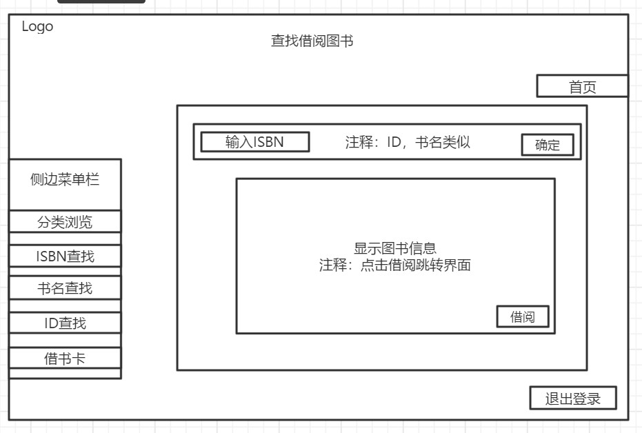

 

#  12.  借阅图书界面：(实现ISBN和书名查找才需要此界面）

逻辑层：以ID字符串为参数的查找图书函数；以用户ID和图书ID为参数的修改图书借阅历史函数；借书所需要的修改信息的一系列函数，可以没有参数；UI层只能提供图书ID和用户ID

UI层：确定按钮：关联槽函数查找图书，根据图书借阅信息，显示图书信息。

确认借阅按钮：跳到借阅成功界面，然后选择返回。

 

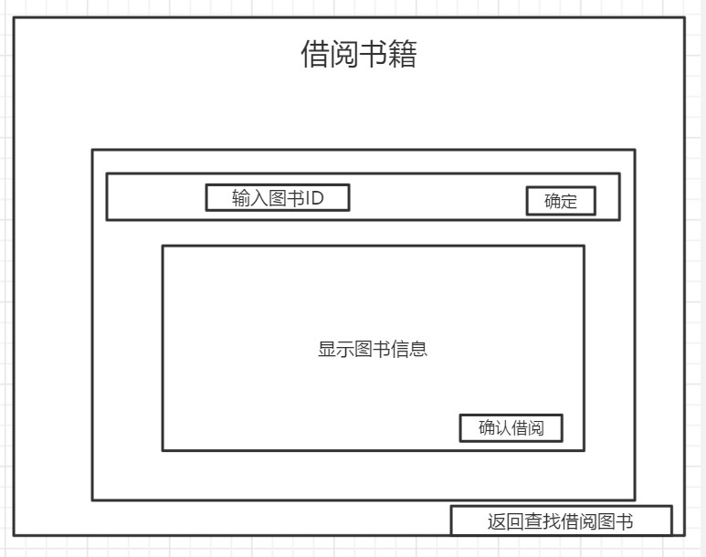

# 13.  借书卡：

逻辑层：

   以图书ID字符串为参数的查找图书函数bool borrow::qtbookexist(int id);

以图书ID字符串为参数的查找该图书的所有借阅历史函数，需要返回图书借阅历史学生的ID，并且是单个分别返回字符串

返回学生id数组，然后ui层根据数组id查找学生信息，返回user类，然后ui层再根据对象的get函数显示信息int* qtreusercard(int id);

UI层：确定按钮：关联槽函数查找图书，根据图书借阅信息，显示图书信息。

返回查找借阅图书：返回查找借阅图书界面。

该界面窗口头文件usercradwid.h 与其关联类的头文件obookcard.h

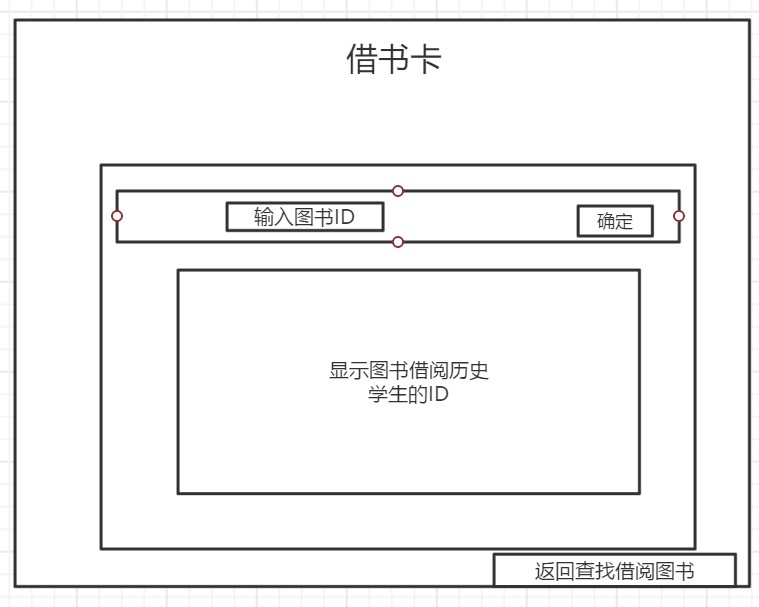

# 14.  归还图书

逻辑层：以ID字符串为参数的查找图书函数，返回图书信息字符串；需要逻辑层提供归还   图书的所修改信息的一系列函数，UI层只能提供图书ID和用户ID；

string DisplayBook(int id)

(先exist 不存在则返回value=“不存在该图书”，存在得到图书信息value)

//把得到的包含所有信息的字符串分发给各个字段

ISBN = value.substr(0, 6);

name = value.substr(6, 8);

author = value.substr(14, 4);

type = value.substr(18, 4);

borrowtime = value.substr(22, 8);

returntime = value.substr(30, 8);

history = value.substr(38, 20);

onsheelf = value.substr(58, 1);

isovertime = value.substr(59, 1);

returnBook(int id)//图书id;

UI层：确定按钮：关联槽函数查找图书，根据图书信息，显示图书信息。

归还按钮：在显示图书信息之后，点击归还按钮，调用还书函数进行还书操作，修改学生借阅信息和书籍借阅信息。

该界面头文件userreturnwid.h 与其关联类头文件ouserreturn.h

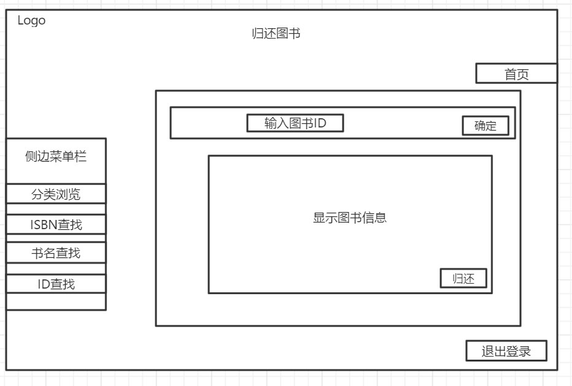

# 15.  分类浏览图书（待实现）

逻辑层：选择一个类，显示这个类图书的信息。需要调用以书所属类别（string）为参数的函数，返回所选类别图书信息。

UI层：分类图书下拉按钮：根据图书的对应属性，在对话框中输入你要查询的信息，然后展示，分页。

该界面头文件userbrowsewid.h

 

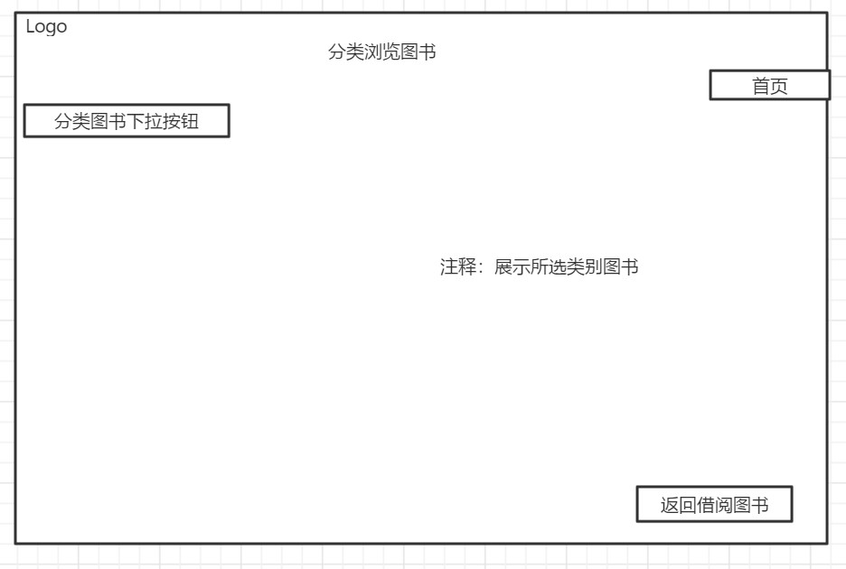

# 16.  已借书籍

逻辑层：根据登录的学生，打开已借书籍界面，显示该学生借书的所有信息，需要以学生ID为参数的显示已借书籍函数，返回已借图书的ID。还需要书籍各条信息的以字符串为参数的返回函数int* qtrebookbor(int id);根据用户id返回图书id数组，根据数组创建图书类的对象，再调用get函数显示信息。

​       UI层：首页：返回首页。

   退出：返回上一级借书还书系统。

该界面头文件userborrowedwid.h  与其关联类的头文件ouserborrowed.h

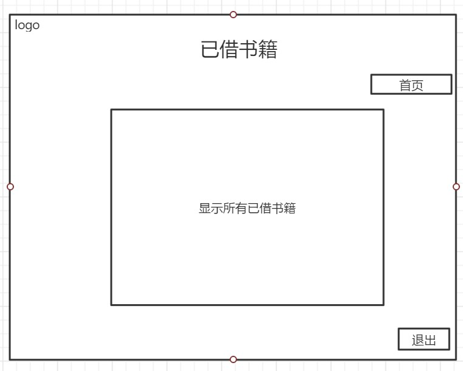

 

 