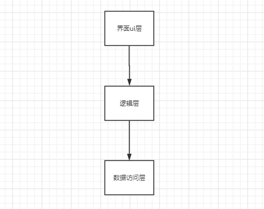
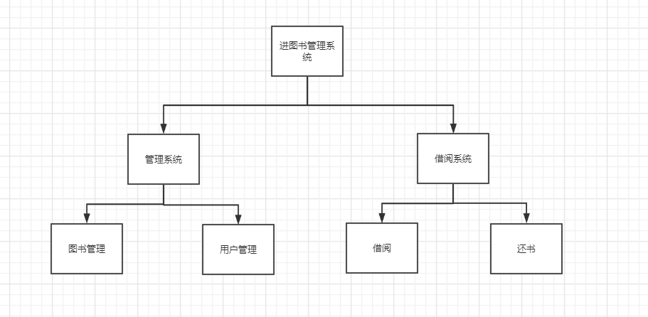
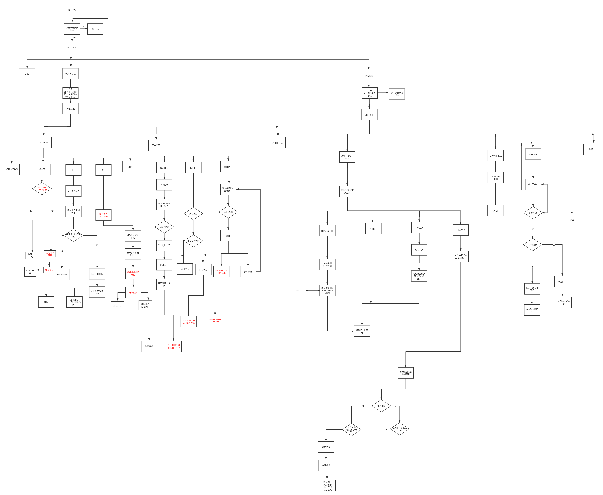
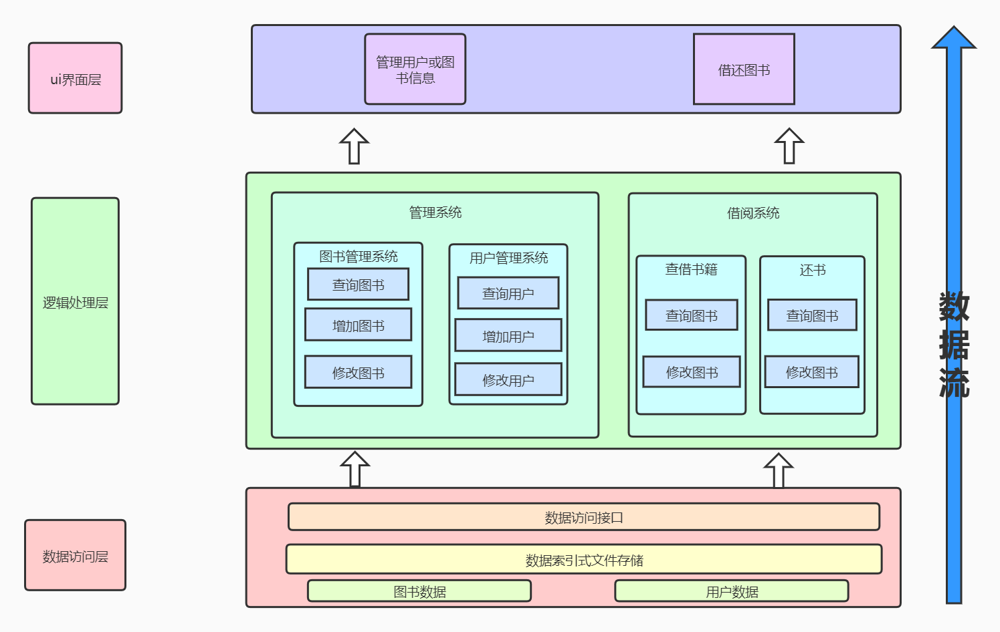
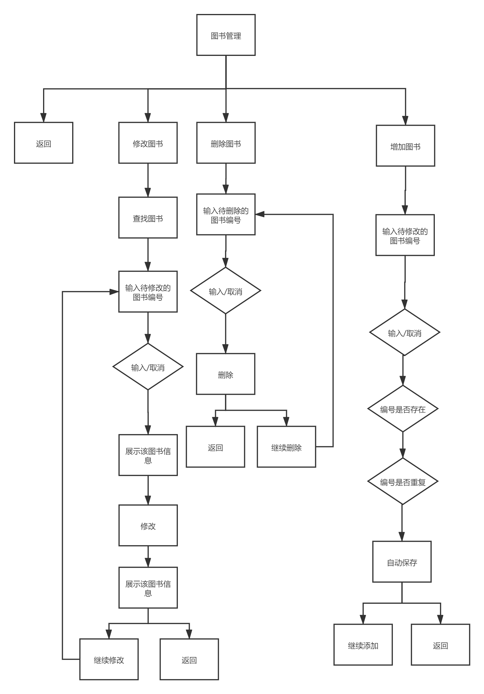
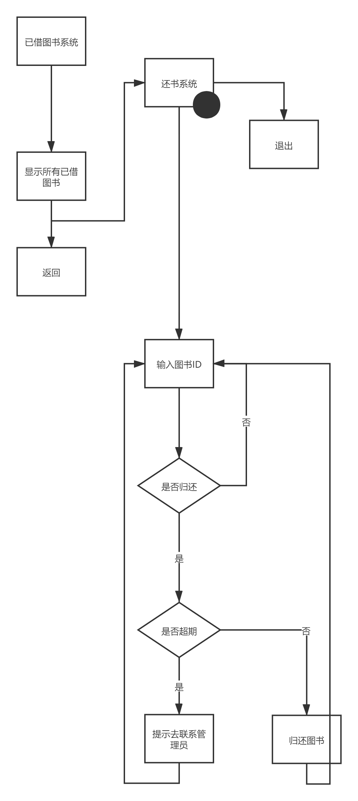
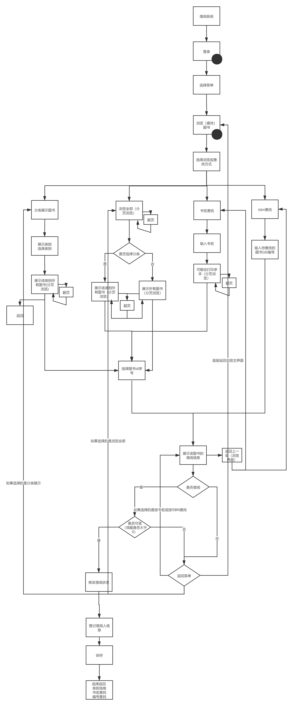
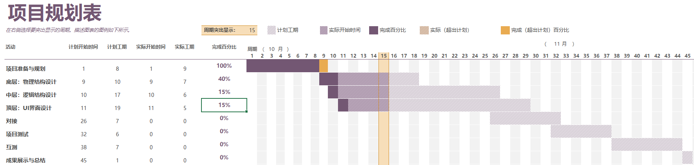
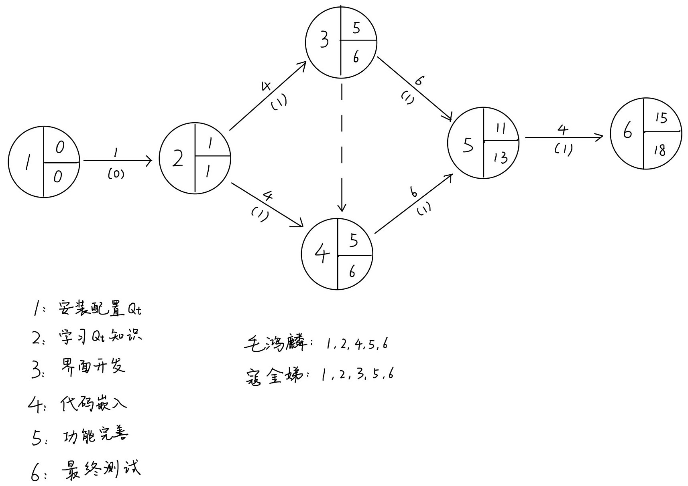
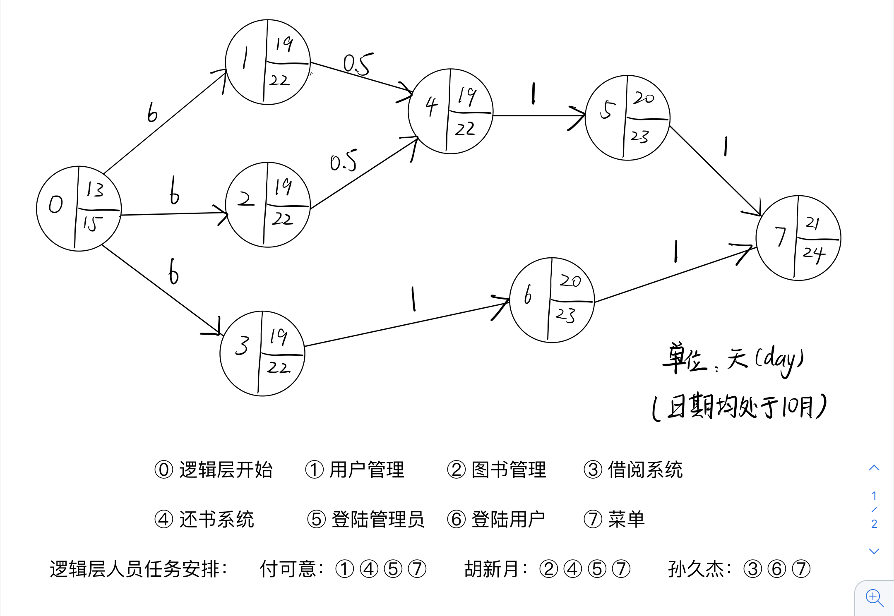

# 设计分析

## 需求分析

### 增量模型


我们的程序决定采用增量模型的结构，把整个程序分解成许多个增量构件，第一个增量构件往往实现软件的基本需求，提供最核心的功能，然后再分批地实现后续功能逐步提交产品。

### 核心需求

对图书的增删查改

对用户的增删查改

借书还书

### 增量需求

多线程拆分关键字搜索

模拟借书卡

图书排行榜推荐

续借图书

数据安全性研究

## 可行性分析

在程序与数据交互访问层面我们讨论了各种解决方案

#### 风险分析

对一些附加功能的风险进行了分析，设计了优先级


# 概念结构设计

指导思想：低耦合高内聚

### 层次分工图



### 简单模块图



### 系统流程图

#### 详细流程图



##### 环行复杂度

我们没有直接计算出环行复杂度，而是根据减小环形复杂度的办法：减小边，增多节点数，减少判断节点。多次优化了流程图。

#### 数据流图



#### IPO图

##### 借阅模块

1.

逻辑层函数名称：登录 login()

底层函数输入参数：userid

调用底层函数：usersearchid(string userid)

底层函数返回值：返回用户对象信息字符串  //逻辑层可以自行提取用户密码与输入密码进行对比

2.

逻辑层函数名称：分类展示 typeshowbook()

底层函数输入参数：booktype

调用底层函数：booksearchtype(string type)

底层函数返回值：返回书籍对象信息字符串

3.

逻辑层函数名称：书名查找 namesearchbook()

底层函数输入参数：bookname

调用底层函数：booksearchname(string name)

底层函数返回值：返回书籍对象信息字符串

4.

逻辑层函数名称：ISBN查找  ISBNsearchbook()

底层函数输入参数：bookISBN

调用底层函数：booksearchISBN(string ISBN)

返回值：返回同类书籍第一本书对应的对象的首地址   //需要你们遍历此链表，得到链表长度后，循环得到每一个对象

5.

逻辑层函数名称：借书 borrowbook()

底层函数输入参数：bookid，

调用底层函数：modifybook(string id)           //用于修改Book onsheelf变量 和在history变量中添加借书人

底层函数返回值：bool


##### 还书模块

1.

逻辑层函数名称：还书 returnbook()

底层函数输入参数：bookid

调用底层函数：modifybook(string id)              //用于修改Book onsheelf

底层函数返回值：bool


##### 用户管理模块

1.

逻辑层函数名称：增加用户 createuser

底层函数输入参数：userid

调用底层函数：useradd(string id,string name,string college,string major,string password,string email)

底层函数返回值：bool

2.

逻辑层函数名称：用户是否已经存在 existuser()

底层函数输入参数：userid

调用底层函数：usersearchid(string id)

底层函数返回值：返回用户对象信息字符串

3.

逻辑层函数名称：删除用户 deleteuser()

底层函数输入参数 ：userid

调用底层函数：userdelete(string id)

底层函数返回值：bool

4.

逻辑层函数名称：修改用户借阅信息 modifyuserdata()

底层函数输入参数：userid

调用底层函数：userstatessearch(string id)

底层函数返回值：bookid

底层函数输入参数：bookid

调用底层函数：booksearchid(string id)

底层函数返回值：返回书籍对象信息字符串

调用底层函数：bookmodify(string id) //修改book onsheelf

底层函数返回值：bool


5.

逻辑层函数名称：是否归还全部图书 returnAllBooks()

底层函数输入参数：userid

调用底层函数：usertatessearch(string id)

底层函数返回值：返回书籍id


##### 图书管理模块

1.

逻辑层函数名称：删除图书 deletebook()

底层函数输入参数：bookid

调用底层函数：bookdelete(string id)

底层函数返回值：bool

2.

逻辑层函数名称：修改图书 modifybook()

底层函数输入参数：bookid 

调用底层函数：bookmodify(string id)

底层函数返回值：bool

3.

逻辑层函数名称：增加图书 createbook

底层函数输入参数：bookid

调用底层函数：bookadd(string ISBN,string name,string author,string type,string id,string borrowtime,string returntime,string history, bool onsheelf,bool isovertime;)

底层函数返回值：bool

4.

逻辑层函数名称：该图书是否已经存在 existbook()

底层函数输入参数：bookid

调用底层函数：booksearchid(string id)

底层函数返回值：返回图书对象信息字符串

# 物理结构设计

## 一、总体说明

### 1.数据结构

数据结构（或数据模块）的形式为 

```c++
(int ISBN, string value)
//value字符串的长度固定为60，包含：id, name, author, type,  borrowtime, returntime, history, onshelf, isovertime。
//onshelf, isovertime两个变量的取值为0或1，对应类中bool值，使用时转换类型即可。
```


​	在上述数据结构中限定ISBN长度为4，id长度为6，name长度为8，author长度为4，type长度为4，borrowtime格式yy-mm-dd，returntime同，长度各为8。history长度为20，onshelf、isovertime长度为1，取值为0或1。value字符串的格式如下：


​	主要的功能为增加、删除、修改、查询，数据结构为B+树，此种数据结构可以保持数据稳定有序，插入、修改有较稳定的对数时间复杂度。

​	使用cache作为缓冲区，利用文件读取的局部性加速读写，cache在内存中，断电不保存。

### 2.文件设计

#### 	1.索引文件

​	每个数据的长度为4个字节，用文件开始的4个字节记录根节点所在地址，若为0则树为空，初始时默认为0。用其后的4个字节标记文件中第一个空白的位置，初值置为8（文件尾）。然后依次是每个节点。每个节点分为三个部分，第一部分为12个字节，3个整数，分别是**父节点地址、此节点的序号、当前节点关键字的个数**（记录方法类似数组，从0开始读写???），根节点不记录上述数据。第二部分为变长，每8个字节记录一组数据：若节点不是叶子，则记录的是**当前节点的关键字**和**该节点孩子的地址**；若节点是叶子，则记录的是**当前节点的关键字和关键字对应的键值的存储地址**（在数据文件中；保存为负数，以便区分叶子节点）。对于叶子，第三部分为4个字节，表示**下一个叶子节点的地址**；非叶子节点不含有此部分。

​	此外，空白位置组成单项链表，最后一项始终为文件末尾。删除节点后将地址链接到链表头部。

#### 	2.数据文件

​	数据文件前4个字节为第一个空白的位置，初值置为4。每条数据60个字节。对空白的处理同上。	

#### 3.日志文件设计说明

程序中的每次操作会将相关信息写入日志文件，主要用于调试。具体形式为：[时间] [操作] [数据]。

### 3.类设计说明

#### 1.Cache类（计划开发）

计划作为数据操作的缓存

#### 2.Database类

##### 1.总体说明

Database类为数据库的主体实现。持有变量scale为B+树的阶数。三个文件流分别对应索引文件、数据文件和日志文件，常量ZERO用于写入空指针。

##### 2.主要流程（对应用户版）

1.查找

（1）用户输入关键码

（2）查找cache，若找到，返回对应的值

（3）否则查找索引文件，若没有找到，返回false

（4）否则根据地址查找数据文件，取出相应的值

（5）将关键码和值插入cache中

（6）若有必要，更新cache中原来的关键码和值

（7）根据返回值输出结果

2.添加

（1）用户输入关键码和值

（2）若cache中存在关键码，返回false

（3）否则查找索引文件，若存在关键码，返回false

（4）否则在数据文件中插入值并获得位置

（5）根据查找结果在索引文件中加入关键码和数据地址

（6）将关键码和值插入cache中

（7）若有必要，更新cache中原来的关键码和值

（8）根据返回值输出结果

3.删除

（1）用户输入关键码

（2）在cache中删除此关键码

（3）查找索引文件，若关键码不存在，返回false

（4）否则根据查找结果在数据文件中删除值

（5）根据查找结果在索引文件中删除关键码

（6）根据返回值输出结果

4.修改

（1）用户输入关键码和值

（2）在cache中更新关键码和值，若成功，返回true

（3）否则在索引文件中查找关键码，若没找到，返回false

（4）否则根据查找结果在数据文件中更新值

（5）将关键码和值插入cache中

（6）若有必要，更新cache中原来的关键码和值

（7）根据返回值输出结果

##### 3.主要函数

（1）Database();构造函数，文件不存在初始化文件

（2）void dataFile_find(const int dataAddress, string &value);数据文件查找

（3）int dataFile_add(const string &value);数据文件添加，返回数据地址

（4）void dataFile_delete(const int dataAddress);数据文件删除

（5）void dataFile_replace(const int dataAddress, string &value);数据文件替换

（6）int indexFile_find(int key, int *indexAddress, int *pos, int *size, int *dataAddress);

索引文件查找，*size为最后一个节点关键码个数。返回值含义为0表示树为空或key小于最小值，1表示命中，2表示在两节点之间，4表示大于最后一个节点最大值。若命中，*indexAddress存放命中叶节点地址，*pos为节点位置，*dataAddress为值在数据文件中的地址。若不命中，*indexAddress存放应该插入叶节点地址，*pos为插入位置（1表示在第一个关键码之后），*dataAddress无意义。对每个节点采用二分查找法。

（7）void indexFile_add(const int key, const int dataAddress, const int indexAddress, int pos, int size);索引文件添加

（8）void indexFile_addAndOverflow(const int key, const int dataAddress, const int indexAddress, const int pos, const int size);索引文件添加并处理上溢

（9）bool indexFile_delete(const int indexAddress, const int pos, int size);索引文件删除

（10）void indexFile_borrowLeft(const int indexAddress, int size, const int left, int leftSize, int parent, int parentPosition);索引文件当前节点向左兄弟借一个关键码

（11）void indexFile_borrowRight(const int indexAddress, int size, const int right, int rightSize, int parent, int parentPosition);索引文件当前节点向右兄弟借一个关键码

（12）void indexFile_mergeLeft(const int indexAddress, const int size, const int left, int leftSize);索引文件当前节点和左兄弟合并

（13）void indexFile_mergeRight(const int indexAddress, int size, const int right, const int rightSize);索引文件当前节点和右兄弟合并

（14）void indexFile_deleteAndUnderflow(const int indexAddress, const int pos, int size);索引文件删除并处理下溢

（15）bool file_update(const int key, string &value);更新到文件

（16）bool select(const int key, string &value);对外接口查找

（17）bool insert(const int key, const string &value);对外接口插入

（18）bool remove(const int key);对外接口删除

（19）bool update(const int key, string &value);对外接口更新

（20）~Database();析构函数，保存cache，关闭文件

# 逻辑结构设计

### 图书类及用户类设计代码

```c++
class bookset{

public:

	string ISBN;//书号

	string name;//书名

	string author;//作者

	string publisher;//出版社

	string type;//图书类别
    
	//int num_total; //总数
    
    //int num_remain; //可借本数

}
```


```c++
class book(parent class bookset){

private：

	string id;//图书编号

	string borrowtime;//借书时间

	string returntime;//还书时间

	string history;//借阅历史

	bool onsheelf;//是否在架

	bool isovertime;//是否超期


public：

	book* next;

	friend ostream& operator <<(ostream& out, book& b);

	friend istream& operator >>(ostream& in, book& b);

	bookdata(){   ; }

	bookdata(string ISBN, string id, string name, string author = 	'NULL', string publisher = 'NULL', string type = 'NULL') //其他参	数同，默认为NULL，需要手动指定或者后期修改


	//以下get方法为获取图书相关参数
        
    string getISBN() { return ISBN; }
    
	string getid() { return id; }

	string getname() { return name; }

	string getauthor() { return author; }

	string getpublisher() { return publisher; }

	string getborrowtime() { return borrowtime; }

	string getreturntime() { return returntime; }

	string gettype() { return type; }


    //以下set方法为输入图书相关参数

	void setISBN(string  ISBN) {}	

	void setid(string id) { cin >> id; }

	void setname(string name) { cin >> name; }

	void  setauthor() { cin >> author; }

	void  setpublisher() { cin >> publisher; }

	void  settype() { cin >> type; }

	

}
```


```c++
class user{

	private:

		string id; //学号

		string name; //姓名

		string college; //学院

		string major; //专业

		string password; //密码

		string email; //电子邮件

	public:

		//student *next;

		friend ostream& operator <<(ostream& out, student& b);

		friend istream& operator >>(ostream& in, student& b);

		//以下两个函数的形式不是完全确定


user(){  ; }

user(string id, string name, string grade = '2020', string college = '基础教学中心')//为每个参数指定默认值，下同


    	//以下get方法为获取用户相关参数

		string getid() { return id; }

		string getname() { return name; }

		string getgrade() {return grade; }

		string getcollege() { return college; }

		string getmajor() { return major; }

		string getpassword() { return password; }

		string getemail() { return email; }


        //以下set方法为设置用户相关参数
    
		void setid() { cin>>id; }

		void setname() { cin>>name; }

		void setcollege() { cin>>college; }

		void setmajor() { cin>>major; }

		void setpassword() { cin>>password; }

		void setemail() { cin>>email; }

		


}
```

```c++
class userstates{//用户借书状态，只要用户当前有借书，则会存储他所有所借书籍的信息，比如书的归还时间，已续借的次数，超期状态等

public:

string id;//用户id

vector <string>bookid; //已借书籍的id信息


}
```

## 图书馆管理员系统类

### 一.总体说明：

模拟图书馆借阅系统管理员输入账号及密码登录系统，实现对用户的增加、删除和信息修改以及对图书的增加、删除和信息修改。



### 类设计代码

```c++
//管理员类

class administor{

public:

string id;//管理员登陆编号

string password;//登录密码

string name;//姓名


administor();

administor(string id, string password);

bool login(string id, string password);//管理员登录


}
```

```c++
//管理员系统

class supervisor{

public:

bool createuser(user* s)//创建新用户

bool modifyuserdata(string id)//修改用户借阅信息

bool deleteuser(string id)//删除用户

bool finduser(string id)//查找用户是否已经存在


supervisor(){;}


bool createbook(book* s)//增加新图书

bool modifybook(string id)//修改图书信息

bool deletebook(string id)//删除图书

bool findbook(string id)//查找图书是否存在


void manageuser()//用户管理界面，调用上述几个用户管理函数

void managebook()//图书管理界面，调用下述图书管理函数

}

```

### 二.主要流程：

#### 1.登录界面：

（1）管理员输入用户名以及密码
（2）根据用户名在数据库中查找相关信息
（3）如果匹配出对应信息，则对比数据库中密码与管理员输入密码是否一致，并打印登陆成功与否的信息

#### 2.用户管理系统：

（1）增加用户：输入用户信息，根据用户ID判断用户是否已经存在，存在则返回上一层界面，不存在则添加新的用户。

（2）删除用户：输入用户ID，根据用户ID判断用户是否存在，存在则删除用户，不存在则返回上一层界面。

（3）修改信息：输入用户ID，根据用户ID判断用户是否存在，存在则展示用户信息，选择其中若干项修改，修改后展示新的用户信息，修改成功后选择继续修改或返回上一层界面，不存在则返回上一层界面。

#### 3.图书管理系统：

（1）增加图书：输入图书ID，根据图书ID判断图书是否已经存在，存在则返回上一层界面，不存在则添加新的图书。

（2）删除图书：输入图书ID，根据图书ID判断用户是否存在，存在则删除图书，不存在则返回上一层界面。

（3）修改信息：输入图书ID，根据图书ID判断图书是否存在，存在则展示图书信息，选择其中若干项修改，修改后展示新的图书信息，修改成功后选择继续修改或返回上一层界面，不存在则返回上一层界面。

### 三.主要函数

1.bool login(string id, string password)

//管理员系统的登录函数，传入ID和密码，与数据库中匹配则显示登录成功

2.bool createuser(user* s)

//传入要增加的用户对象，不存在则添加用户信息

3.bool modifyuserdata(string id)

//按ID查找用户，查询并修改用户信息

4.bool deleteuser(string id)	

//按ID查找用户，存在则删除用户信息

5.bool finduser(string id)

//按ID查找用户，判断用户是否存在

6.bool createbook(book* s)

//传入要增加的图书对象，不存在则添加图书信息

7.bool modifybook(string id)

//按ID查找图书，查询并修改图书信息

8.bool deletebook(string id)	

//按ID查找图书，存在则删除图书信息	

9.bool findbook(string id)

//按ID查找图书，判断图书是否存在

10.void manageuser()		

//用户管理界面，调用上述几个用户管理函数

11.void managebook()		

//图书管理界面，调用下述图书管理函数

## 图书馆借阅系统类

### 一.总体说明：

模拟图书馆借阅系统读者输入账号及密码登陆系统，运用分类查看、根据ID、书名、ISBN查找（模糊查找）所要的书目，选择想要借阅的书目进行借阅，并更改用户借阅记录状态以及图书的借阅历史记录。





### 类设计代码


```c++
class borrow{

bool login(string id, string password)
//借阅系统的用户登陆函数，传入ID名和密码，根据ID名在数据库中查找该用户并与数据库中记录进行比对，匹配则返回True，否则返回False

void typeshowbook（string type）
//传入想要查阅书籍的类型，查询数据库并显示符合该类的所有图书的信息，如果数量过多则分页展示。

void ISBNsearchbook（string ISBN）
//用户输入想要借阅书籍的ISBN，根据ISBN查询数据库中匹配的书籍信息，并显示书目的信息

void namesearchbook (string name)
//用户输入想要借阅书籍的书名，根据书名查询数据库中匹配的书籍信息，并显示书目的信息

void menu（）
//显示可供操作的所有菜单选项，包括登陆、返回等功能

void submenu（）
//显示所有可供操作的子菜单选项，包括分类查询、精确查找、借阅图书、查看图书详情等操作

void typedisplay（）
//显示所有可供查询的图书类别，如全部、人文、小说、科幻、惊悚等

void nextpage() 
//当符合条件的信息条目很多时，会分成多页展示，此函数可使展示界面转到图书信息的下一页

void borrowbook(string id)
//调用book类、student类函数进行借阅，并修改用户借阅信息以及图书历史借阅记录

bool isuser(string id){
//在登陆阶段时读取用户输入的ID号后查询数据库，以判断用户是否已经存在于数据库中，如果存在则返回True，否则返回False

}		
```


### 二.主要流程：

#### 1.登陆界面：

（1）用户输入用户名以及密码
（2）根据用户名在数据库中查找相关信息
（3）如果匹配出对应信息，则对比数据库中密码与用户输入密码是否一致，并打印登陆成功与否的信息

#### 2.查找系统：

 （1）用户选择查找方式（按类型、ID、ISBN、书名、模糊查找等）输入书的信息进行查找
 （2）从数据库中查找相关信息，打印出匹配的书籍信息

#### 3.借阅：

（1）用户选择好想要借阅的书籍，点击借阅按钮
（2）后台查看该书籍是否可借阅，如果可借阅，则显示借阅成功，并修改相关的读者借阅信息以及书籍借阅历史记录

### 三.主要函数：

1.bool login(string id, string password)
//借阅系统的用户登陆函数，传入ID名和密码，根据ID名在数据库中查找该用户并与数据库中记录进行比对，匹配则返回True，否则返回False

2.void typeshowbook（string type）
//传入想要查阅书籍的类型，查询数据库并显示符合该类的所有图书的信息，如果数量过多则分页展示。

3.void ISBNsearchbook（string ISBN）
//用户输入想要借阅书籍的ISBN，根据ISBN查询数据库中匹配的书籍信息，并显示书目的信息

4.void namesearchbook (string name)
//用户输入想要借阅书籍的书名，根据书名查询数据库中匹配的书籍信息，并显示书目的信息

5.void menu（）
//显示可供操作的所有菜单选项，包括登陆、返回等功能

6.void submenu（）
//显示所有可供操作的子菜单选项，包括分类查询、精确查找、借阅图书、查看图书详情等操作

7.void typedisplay（）
//显示所有可供查询的图书类别，如全部、人文、小说、科幻、惊悚等

8.void nextpage() 
//当符合条件的信息条目很多时，会分成多页展示，此函数可使展示界面转到图书信息的下一页

9.void borrowbook(string id)
//调用book类、student类函数进行借阅，并修改用户借阅信息以及图书历史借阅记录

10.bool isuser(string id){
//在登陆阶段时读取用户输入的ID号后查询数据库，以判断用户是否已经存在于数据库中，如果存在则返回True，否则返回False
		

# 界面结构设计


# 详细分工

## 界面ui层

### 寇金娣

图形界面

图形界面由窗口组成，里面有按钮以及其他一些信息，需要操作并完成信息的显示，需要有好的交互性。此部分由寇金娣同学完成。

### 毛鸿麟

代码部分

软件需要代码，并且代码要随着图形界面工作。因此代码要随着图形界面而修改，所以需要将其他同学写的代码和完成的功能嵌套入图形界面。此部分由毛鸿麟同学完成。

1.Qt的下载及配置

2.Qt相关知识的学习

3.根据小组的流程图设计了界面流程图。


## 逻辑结构层

### 胡新月

1. 图书管理
2. 还书系统
3. 管理员登录
4. 菜单界面

#### 孙久杰

1. 借阅系统
2. 用户登录
3. 菜单界面

#### 付可意

1. 用户管理
2. 还书系统
3. 管理员登录
4. 菜单界面


## 数据访问层

### 刘云卿

1.项目整体规划

2.每周项目汇报

3.小组展示

4.用户数据访问

### 全子修

1.图书数据访问

2.全面协助组长工作


# 工程进度控制

### 甘特图



## 工程网络图

### ui界面层



### 逻辑层



### 数据访问层


## 当前工作进度日志

## ui界面层

寇金娣、毛鸿麟

下载Qt5.9.0，并配置Visual Studio，两人都要完成。我们已经安装了QT5.9.0并在Visual Studio配置好了。

由于我们几乎没有Qt的基础，并且需要逻辑层和底层设计之后基本上才能设计图形界面，所以我们需要学习Qt相关的知识，为之后的图形界面开发打下了基础。两人都要完成。我们学习了QT图形界面的相关知识，比如按钮、分页等，并开始尝试制作了简单的事例程序。

## 逻辑层

胡新月、付可意、孙久杰

我们一起商讨了逻辑层的实现流程，完善了对应模块的流程图。然后划分了每个人负责的逻辑层模块，由付可意和胡新月分别负责管理员系统中的用户管理和图书管理功能，二人一起协商还书功能以及管理员系统对应的管理员登录界面。孙久杰负责借阅系统中的借书相关功能，以及借阅系统对应的用户登录界面。最后由三人共同协商顶层菜单实现。
在划分完各自的任务之后，我们一起根据底层实现的计划和进度作出了逻辑层的工程网络图，根据底层的接口文档作出了相关的类设计说明。然后根据工程网络图的安排开始着手一些功能的实现，等待底层功能完成，准备着手测试。

## 数据访问层

刘云卿、全子修

### 分工职责内工作

- 附图解释索引文件底层结构
- 数据访问模块解决方案：
- 字符串输入解决方案
- 字符串读取，字符串修改解决方案 
- 字符串定长空格填充
- 数据操作函数初步解决方案
- 将来可能做多键搜索，目前是单键，每次搜索需要遍历全表

### 整体工作

- 编写项目汇报文档
- 制定接口文档
- 编写底层技术文档
- 规定文件的逻辑与存储
- 绘制系统流程图
- 绘制甘特图
- 绘制工程网络图
- 绘制IPO图
- 制作展示ppt
- 编写开发日志
- 指导组员工作并给出解决方案


